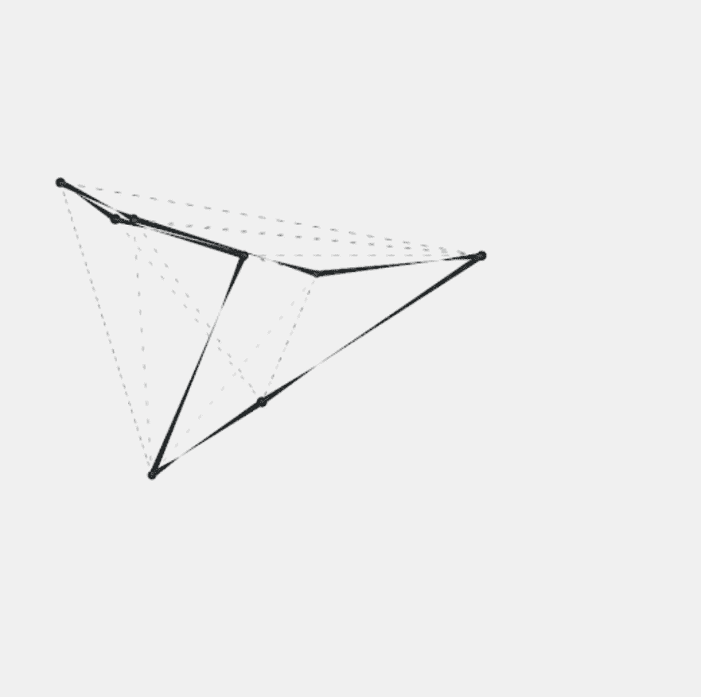

# Study of lines

一组 IOOO 生成艺术作品极简主义、简约和线条一个尝试极简主义的生成艺术项目。薄荷生成很高兴你喜欢这个项目，我们得到了爱！我们正在开展一个项目，线条研究的持有者会得到一个惊喜，我们再次得到了对每个铸造者的爱，为接下来发生的事情做好准备<3 – 团队很高兴看到你喜欢艺术！*线*是几何学中的一维图形，它有长度但没有宽度，并且在相反的方向上无限延伸。学习不同类型的...

