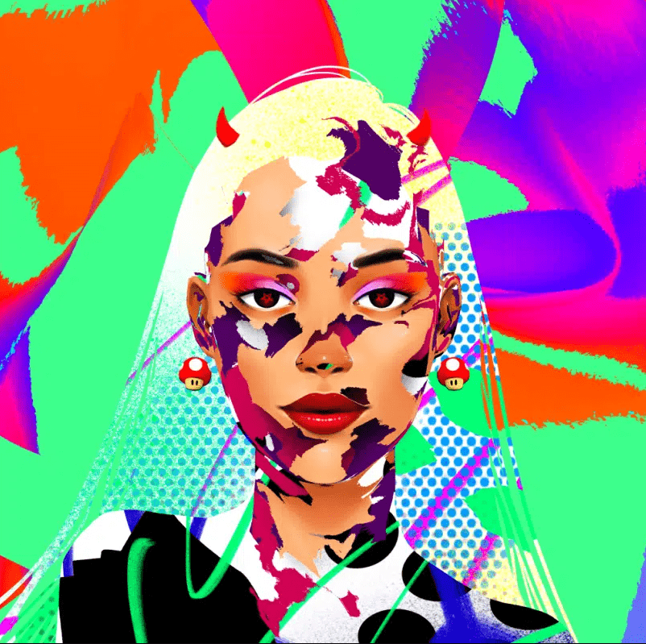

# Sublimes

崇高是 1,111 位抽象皇后，他们生活在元节的不同维度。

该项目是 NFT 有远见的[WorldNFTs]和艺术家[MZK]之间的合作。

每个创世 NFT 的持有者都是社区钱包的共同所有者，该钱包投资于即将到来的才华横溢的艺术家。

Sublimes 是 1,111 个抽象皇后的生成集合，她们生活在元节的不同维度。

它们外观中的抽象元素来自于我们只能感知它们维度的一些片段。

我们促进寻找即将到来的才华横溢的艺术家的过程，帮助他们接触更广泛的观众，并将他们与正在寻找下一个大宝石的高度策划的艺术收藏家社区联系起来。

为此，我们创建了一个数字旅程，通过该旅程找到有才华的艺术家，由社区投票，并通过一系列促销和 NFT 项目支持他们，让他们在每一步都能接触到更多的观众。

