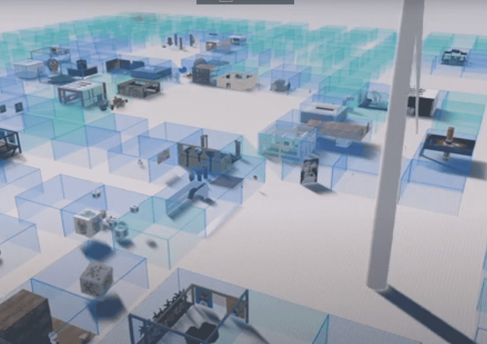

# Substrata

Substrata 是一个多用户网络空间/元宇宙。与其他用户聊天或探索其他用户创建的对象和地点。
您也可以创建一个免费的用户帐户并向世界添加对象！

Substrata 中的地块正在[出售](，可以铸造为以太坊 NFT。

Substrata 处于早期开发阶段，请期待粗糙的边缘！我们目前正在 Substrata 中嵌入[CryptoVoxels](https://www.cryptovoxels.com/)世界，用于测试和娱乐目的！

要探索 CryptoVoxels 世界，只需安装并运行 Substrata，然后从菜单栏中选择：

前往 > 前往 CryptoVoxels 世界

