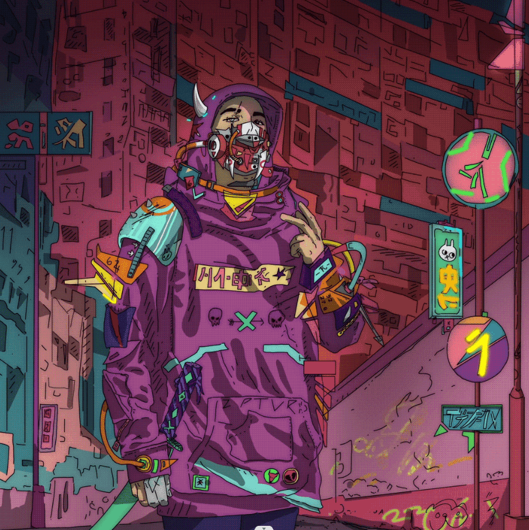

# Suburban Colorse

SuburbanColors 是 3 个独特的 Rebels 和 Robots NFT 的纯赛博朋克艺术和实用工具系列。这是Rebels系列。创世纪系列：[郊区 创世纪] 机器人系列SuburbanColors 是 2199 件赛博朋克艺术和实用工具的集合。收集的目标是提供娱乐并尽可能奖励持有者。

该系列由不同类别的 Rebels 和 Robots 组成。这些碎片可以在给定日期或在 OpenSea 中通过铸币厂获得。每笔交易最多 3 分钟，每个钱包没有限制。

1024 Rebels 系列的首次发布已售罄。
1175 Robots 的第二次也是最后一次发布日期是 2022 年 4 月 7 日。目前有一些促销活动：
\- 通过在 OpenSea 中购买 1 个 Rebel NFT，您将获得一个 Robot NFT。
\- 对于大男孩：通过在 Opensea 购买 4 个 Rebels，您可以获得 2 个机器人，购买 8 个可以获得 4 个机器人，购买 12 个可以获得 6 个机器人。

