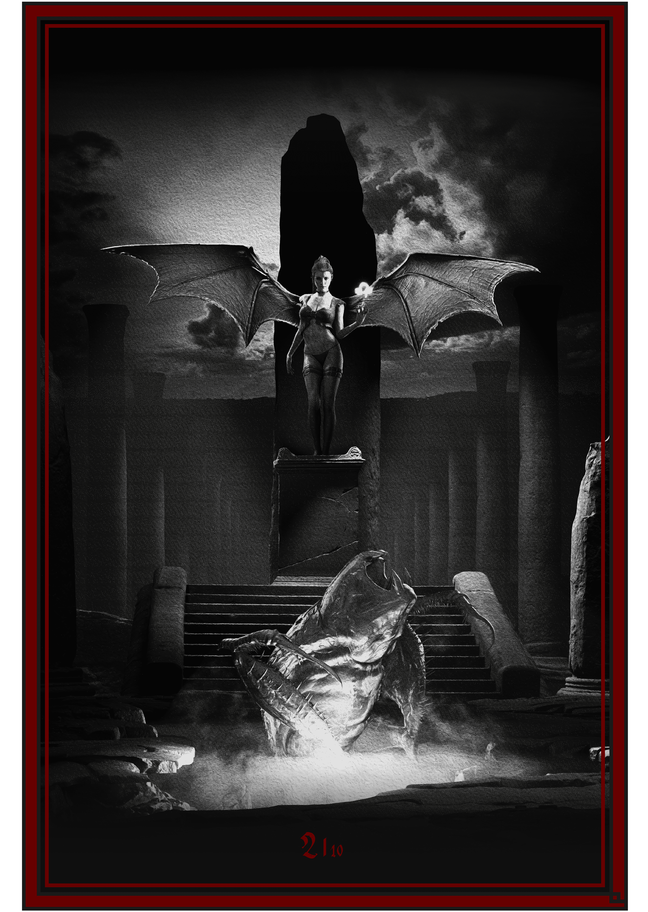

# Succubus DAO

succubus nft 系列包含 10000 张独特的图像，这些图像由 650 多种手工设计的变体生成。

Succubus-NFT NFT - 常见问题（FAQ）

▶ 什么是 Succubus-NFT？

Succubus-NFT 是一个 NFT（Non-fungible token）集合。存储在区块链上的数字艺术品集合。

▶ Succubus-NFT 代币有多少？

总共有 9,600 个 Succubus-NFT NFT。目前 10 位所有者的钱包中至少有一个 Succubus-NFT NTF。

▶ 最近卖出了多少 Succubus-NFT？

过去 30 天内售出 0 个 Succubus-NFT NFT。新君王寧錄用罪人的屍體打造起一個帝國，並與新女王，也就是你，一起掌控了地獄的混沌。然而，在用殉道者的皮肉做成的血紅地毯上漫步的奢侈生活卻無法讓你滿足，

