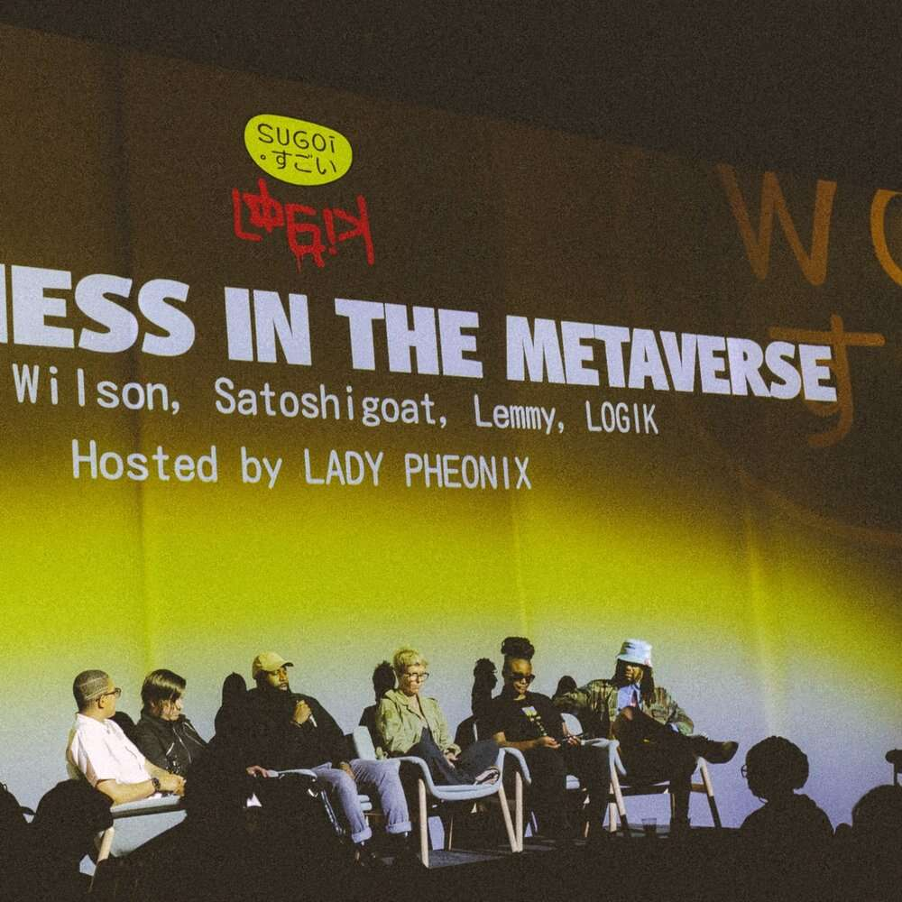

# Sugoi NFT NYC 2022

该 NFT 使持有者能够通过 LOGIK 回复进入 Sugoi NFT NYC 的资格。在活动期间，为了保证客人的安全，进入场地始终受总访客人数的限制。

Sugoi 是一个为期 3 天的 NFT/web3 艺术和音乐节，由 LOGIK 于 2022 年 6 月 21 日至 23 日在布鲁克林 DUMBO 策划。Sugoi 举办引人入胜的小组讨论和充满活力的音乐表演，周围环绕着来自 NFT 领域领导者的沉浸式艺术。

每天的独特活动将汇集科技企业家、开发人员、3D 动画师、音乐家、加密早期采用者、表演者、摄影师、NFT maxis 和新人等，在这座不夜城中进行独特的异花授粉。

Sugoi的意思是“太棒了！哇！” 在日语中，二级销售将支持千叶中心，这是 LOGIK 面向全球黑人创意社区的在线日语学校。

加入我们，在 NFT NYC 与 web3 狂热者建立现实世界的联系。菅井！

