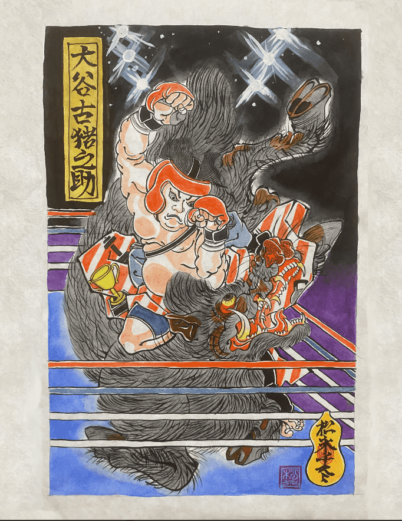

# SUIKODEN 108

Suikoden Legends 的现代英雄是对歌川国芳 19 世纪多产作品的当代重新想象。我们的项目是重新构想和当代化歌川国芳多产的 19 世纪作品的合作努力。国芳被广泛认为是日本浮世绘传统木版印刷艺术的最后一位多产大师。国芳的作品除了在小众艺术家社区之外，在日本以外并不为人所知。然而，松崎工作室坚信歌川《大众水阁传》系列的艺术性、广度和灵魂是真正超越时间的。我们力求以将国芳愿景的精髓带给当代观众的方式重新诠释这些作品，

