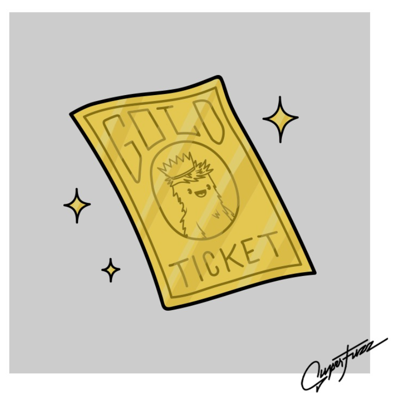

# Superfuzz Gold Tickets

其中只有 200 个存在！ 10 预留赠品！ 这种稀有 NFT 的幸运拥有者将有权使用 Superfuzz 世界不断扩展的实用程序。

以下是发生的事情：
阿特拉斯实验室是一家专门从事克隆的高科技企业，被一个匿名的外国机构秘密雇用，以开发和克隆可怕的屠杀和战争武器，以终结世界的自由与和平。

项目启动后不久，Atlas Labs 的 CEO 就死于一场悲惨的事故中。 把一切都留给了他唯一的女儿后，她决定改变一切，从怪物开始。

未完待续…

