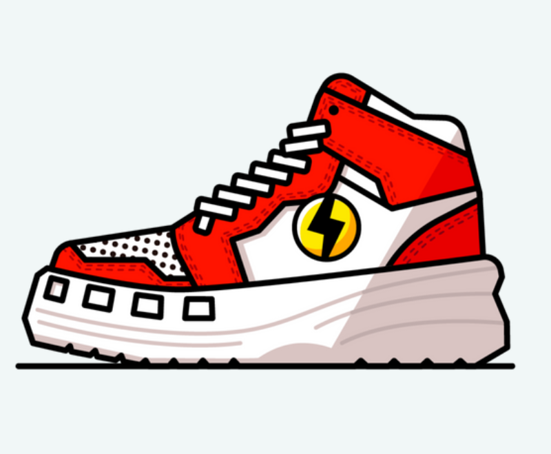

# SuperWalk CoIIection

Superwork 是一款基于区块链的奖励应用程序，只需步行即可获得代币。
每双鞋等级和档次是划分的，性能、耐久度、合身度、运气点的给出也不一样。
每双鞋都是独一无二的设计，这个世界上只有一双。SuperWalk 是一项基于 Klaytn 的 Move-To-Earn 服务，只需步行即可提供代币。 在过去的九个月里，SuperWalk 团队一直在运营一个名为 Proground 的正在运行的应用服务。 我们热情地致力于建立用户的锻炼程序，并观察和研究他们的特点。

