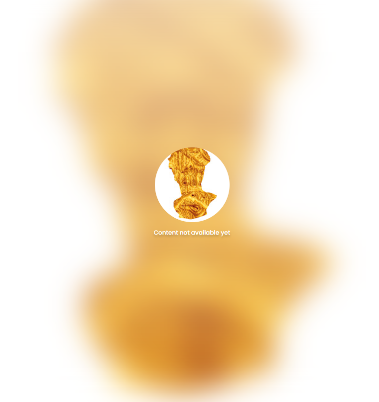

# Supporter Pass

欢迎来到 Ciphersquares，一种加密 NFT 体验。 加入我们，探索隐藏的意义并找到圣杯。 拥有一件艺术品可以让您完全进入反乌托邦的冒险之旅，这是一座以现代罗马为基础的摇摇欲坠的城市。 通过可收藏的头像、独家游戏等深入了解这座城市的传说。

Supporter Pass NFT - 常见问题（FAQ）
▶ 什么是支持者通行证？
Supporter Pass 是一个 NFT（不可替代代币）集合。 存储在区块链上的数字艺术品集合。
▶ 有多少个 Supporter Pass 代币？
总共有 225 个 Supporter Pass NFT。 目前，89 位所有者的钱包中至少有一个 Supporter Pass NTF。
▶ 最近卖出了多少支持者通行证？
过去 30 天内售出 0 个 Supporter Pass NFT。

