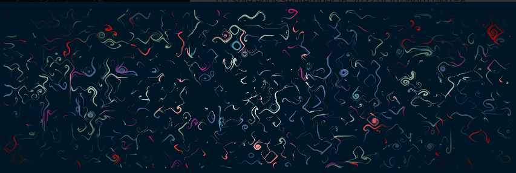

# Surge Emergence

PERMUTATIONS 是一个高能量生成系列，通过重新排列形状来描绘持久性和确定性。 艺术家创作新系列的旅程是连续且充满挑战的； 他们投入数百个小时进行测试，并在数千个输出中反复迭代，因为他们试图从视觉上说明他们最初的愿景。

走向最终和永久收藏的这一复杂旅程是 Permutations 的灵感来源，旨在通过画布上嵌入形状的不断重新排列、扭曲和可变性来举例说明制作此类收藏的本质。

每个排列都会产生一个完全独特且不可更改的片段，由之前的事件以及唯一的种子/事务哈希决定。 每个收藏家都可以亲身体验在他们眼前制作的每一件作品，帮助他们深入了解他们的作品，并在他们自己的排列中经历那种永恒的感觉。

