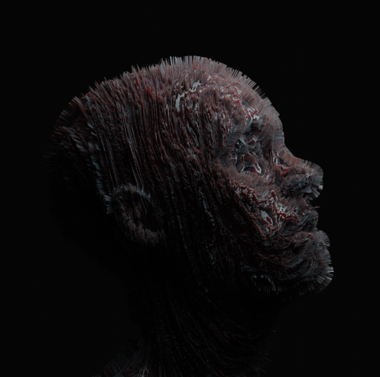

# SURREAL CREATIONS BY AZEE

超现实主义是一种文化，其原则、理想和实践通过不自然或不合理的组合在艺术中产生不协调的意象或效果。 Azee 的超现实创作基于相同的原理。 一组 3D 超现实艺术作品在以太坊区块链上的这个虚拟世界中崭露头角。 每个 Token Art 都以自己的方式独一无二，具有独特的表达方式

NFT stats 为您提供有关 NFT 空间的最新信息。 如果您想找到最好的 NFT 购买、即将推出的 NFT 项目、最昂贵的 NFT 是什么——我们将为您提供您需要的数据、图表、见解和新闻。
本网站上的数据来自各种 NFT 市场和 NFT 项目创建者自己。 我们还直接从 Twitter 和 Discord 获取 NFT 社区统计数据。

