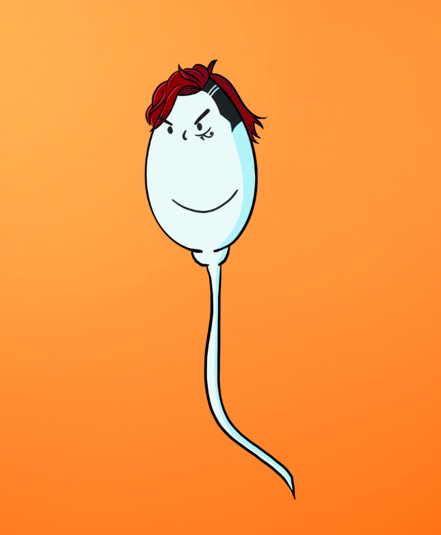

# Survived Ones - GENESIS

今天揭晓加入我们的实验，玩得开心！第一次在 NFT 领域，你从一个合同中铸造，但从两个不同的收藏中获得物品。我们喜欢等待揭示，对吧？ 为什么我们在铸币时不会体验到同样的兴奋？ 这就是我们制定幸存者合同的原因。 如果您足够幸运或最终从 gen2 收藏中铸造，它允许您从 genesis 收藏中铸造。一旦我们决定制定这样的合同，我们试图找到让每个人都易于理解的最佳想法。 而“精子”是最好和最有趣的想法。 它是如何工作的？当你铸造一个精子时，它有大约 8% 的机会存活。 如果它幸存下来，您会从“幸存者”系列中铸造一件物品。 （创世纪）如果没有，您从“Dead Ones”系列中铸造一件物品。 (GEN2)

