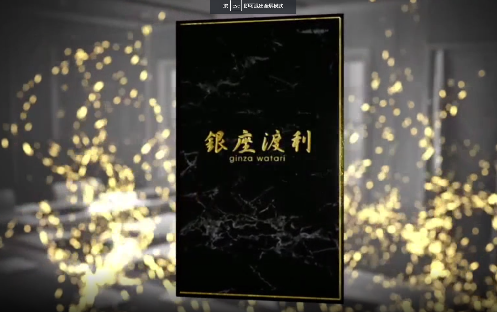

# SUSHI TOP SHOT 1st

“SUSHI TOP SHOT”是江户前寿司刀处理等熟练工艺的 NFT，前五种类型是“maguro（金枪鱼）”、“kohada”、“竹荚鱼”、“kasugo”和“ masu三文鱼”。■银座渡等主厨的详细介绍渡边哲也（主厨）渡边哲也1988年出生于栃木县。在东京神乐坂的寿司店工作了七年之后，他被分配到工作 在银座的一家高档寿司店工作了两年。 在银座的一家寿司店工作期间，他开设了一个名为“Ginza Watari”的频道，大约一年的时间就达到了90,000名订阅者。 2020年10月，他在涩谷青山开设了Sushi Watari。 涩谷店现在是日本传统技艺和世界最先进技术的交汇点。

