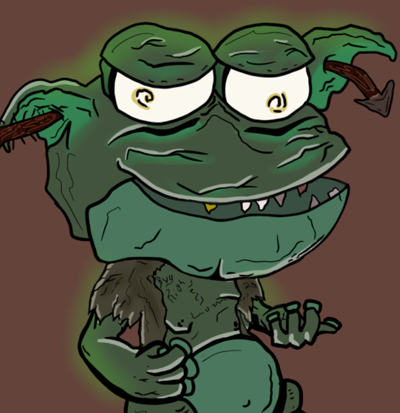

# Swamptown

沼泽古布林兹！ 大沼泽被妖精感染了，他们是小便。 打嗝。 克鲁奥克。 得到你的狼吞虎咽，撒尿在其他 en-eff-tees 上！

Swamptown NFT - 常见问题（FAQ）
▶ 什么是沼泽镇？
Swamptown 是一个 NFT（非同质代币）集合。 存储在区块链上的数字艺术品集合。
▶ 有多少 Swamptown 代币？
总共有 1,435 个 Swamptown NFT。 目前，299 位车主的钱包中至少有一个 Swamptown NTF。
▶ Swamptown 最昂贵的销售是什么？
出售的最昂贵的 Swamptown NFT 是 Swamplinz #390。 它于 2022-06-06（3 个月前）以 36.3 美元的价格售出。
▶ 最近卖出了多少沼泽镇？
过去 30 天内共售出 43 个 Swamptown NFT。
▶ 一个沼泽镇要多少钱？
在过去 30 天里，最便宜的 Swamptown NFT 销售额低于 3 美元，最高销售额超过 91 美元。 Swamptown NFT 在过去 30 天内的中位价格为 18 美元。

