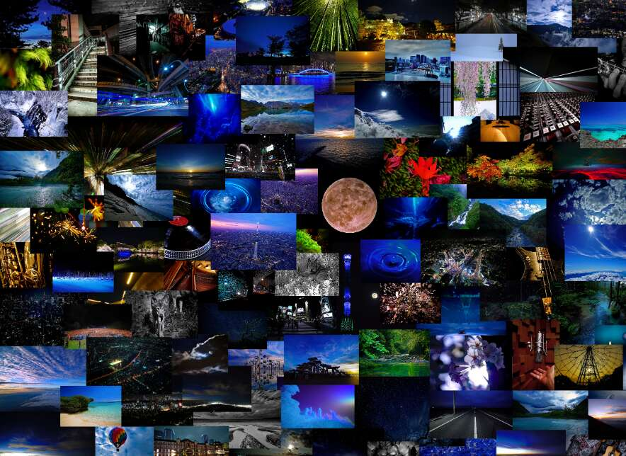

# TAKUYA CryptoArt

TAKUYA∞是六人摇滚乐队UVERworld的主唱。 UVERworld 是日本领先的摇滚乐队之一。 他们2019年在东京巨蛋举行的为期2天的音乐会让大约10万粉丝陷入了狂热。 他们为《我的英雄学院》、《机动战士高达00 The Movie》、《约定的梦幻岛》等众多动漫录制了主题曲，并进行了许多现场表演。 在现场表演中，TAKUYA∞富有表现力的声音和饱满的动作让会场的每个人都为之倾倒。 TAKUYA∞的表现力不仅在现场表现出来，而且在相机上也表现出来。

