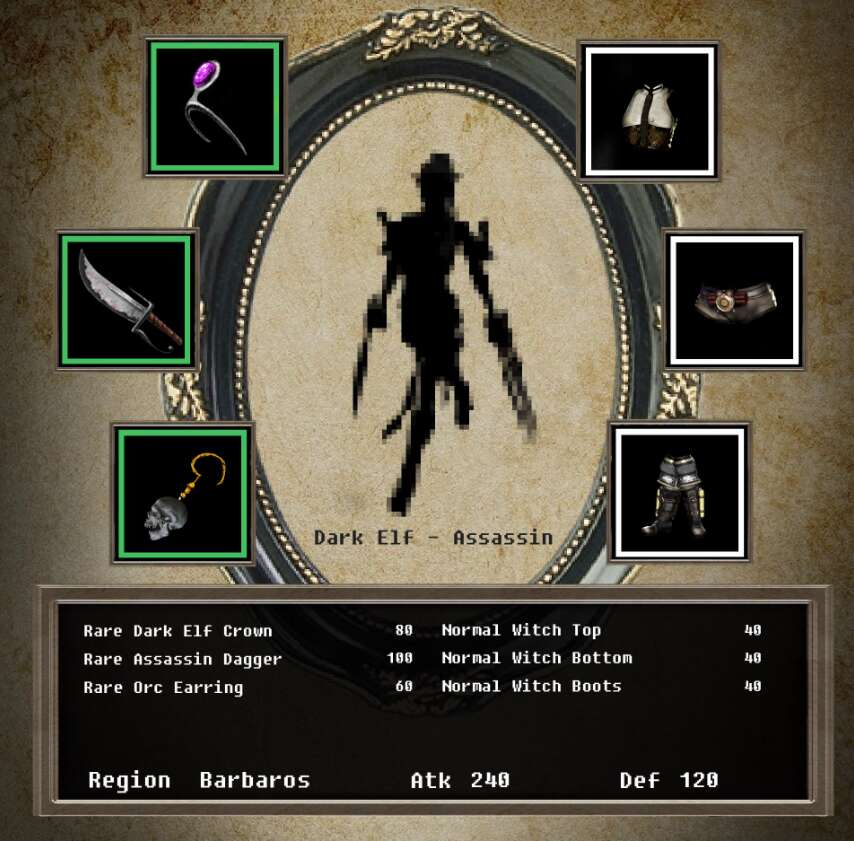

# Tale Of Raynor

Thor 是韩国第一个基于 KLAYTN 的具有物品库存概念的 NFT 项目。 以中世纪奇幻故事为基础，我们计划进行各种引入治理系统的内容，共有4个部落、8个职业和来自5个国家的元素作为属性，每个职业将呈现不同的项目。NFT stats 为您提供有关 NFT 空间的最新信息。 如果您想找到最好的 NFT 购买、即将推出的 NFT 项目、最昂贵的 NFT 是什么——我们将为您提供您需要的数据、图表、见解和新闻。
本网站上的数据来自各种 NFT 市场和 NFT 项目创建者自己。 我们还直接从 Twitter 和 Discord 获取 NFT 社区统计数据。

