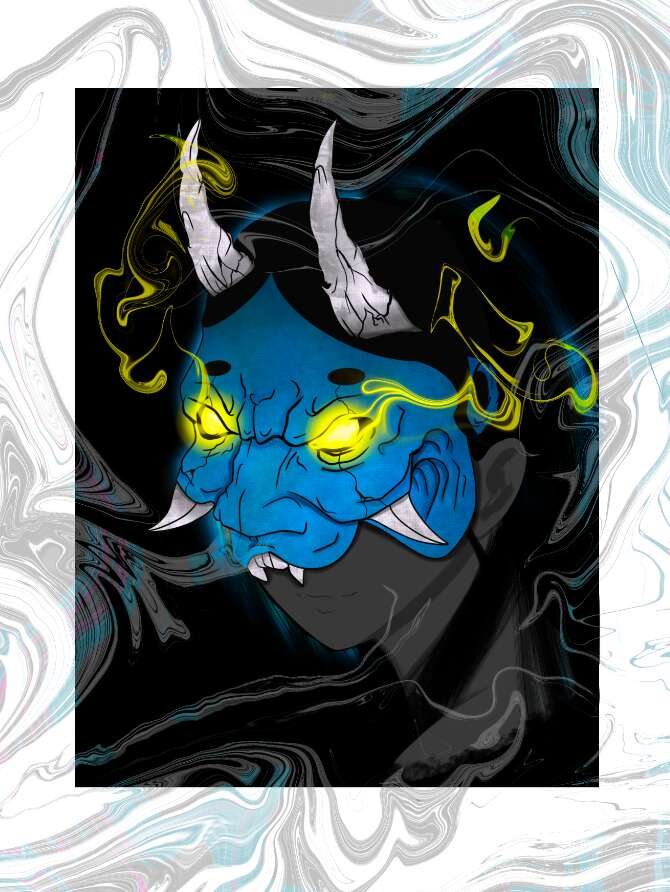

# Tales of Otori

1/1 系列的隐谷忍者和武士氏族中的重要人物。

大鸟传说 NFT - 常见问题（FAQ）
▶ 什么是大鸟物语？
Tales of Otori 是一个 NFT（非同质代币）集合。 存储在区块链上的数字艺术品集合。
▶ 存在多少个大鸟传说代币？
总共有 10 个大鸟传说 NFT。 目前 8 位所有者的钱包中至少有一本 Tales of Otori NTF。
▶ 《大鸟传说》最贵的拍卖品是什么？
售出的最昂贵的大鸟传说 NFT 是 Shigeru。 它于 2022 年 6 月 29 日（2 个月前）以 109.8 美元的价格售出。
▶ 大鸟物语最近卖了多少？
过去 30 天内售出了 4 个 Otori NFT 的故事。

