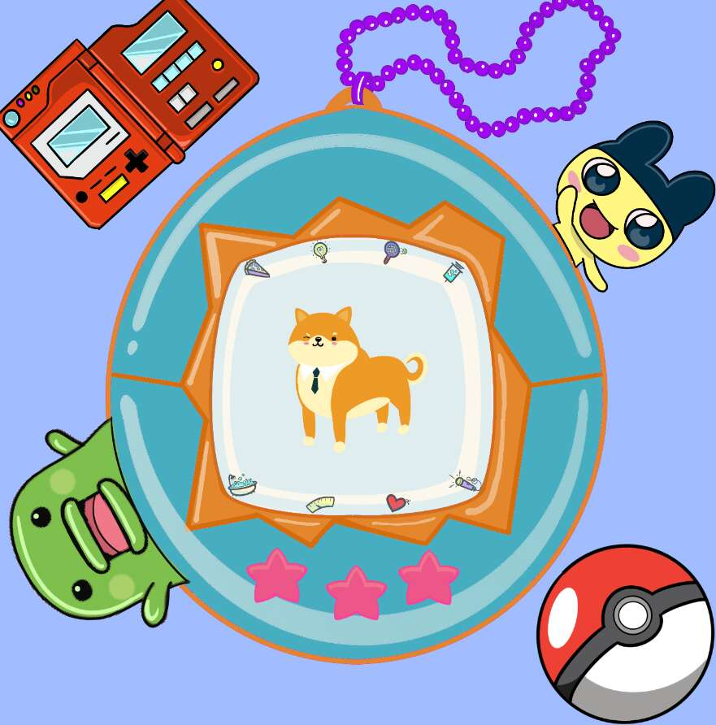

# TamaDoge Pets

Tamadoge Pets 是 Polygon 区块链上由社区驱动的 4K 随机生成的 NFTS 的有机集合。 我们的目标是在 Metaverse 上建立一个收养的社区。 收养不仅可以让您获得终生的爱，还可以让您获得 Dogedrip，这些收藏品可以用您的 NFT 铸造，用于装扮、玩耍和抽搐时间，还可以向南非开普敦的眼泪动物收容所捐款。 我们在 1.0 版中的 2022 年路线图是关于建立一个 fwend 社区、发布可爱的商品和发布我们的虚拟游戏日期，采用者将能够通过稀有的排行榜排名来铸造他们采用的 fwend，以获得很棒的赠品。 我们的路线图 2.0 将于 2022 年晚些时候公布！

