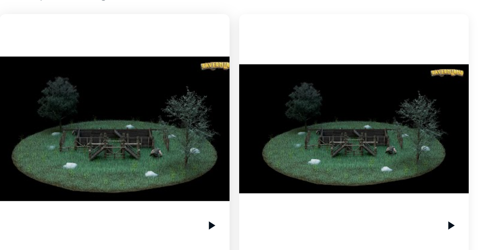

# Taverns in Tavernland

Tavernland 是一款基于网络的革命性 NFT 角色扮演游戏，在以太坊上推出。游戏的核心围绕在完成任务、在酒馆工作、交易商品和收取费用后，用金酒馆代币奖励玩家。酒馆老板可以雇佣员工、制作工艺、烹饪和做广告以增加收入。旅行者可以交易他们的物品和任务，并参加 Tavernland 活动来赚取代币。员工可以在学院获得认证，在酒馆打工赚取收入。▶ 什么是 Tavernland 中的酒馆？
Tavernland 中的 Taverns 是一个 NFT（不可替代的代币）集合。在区块链上的数字存储替代品集合。

