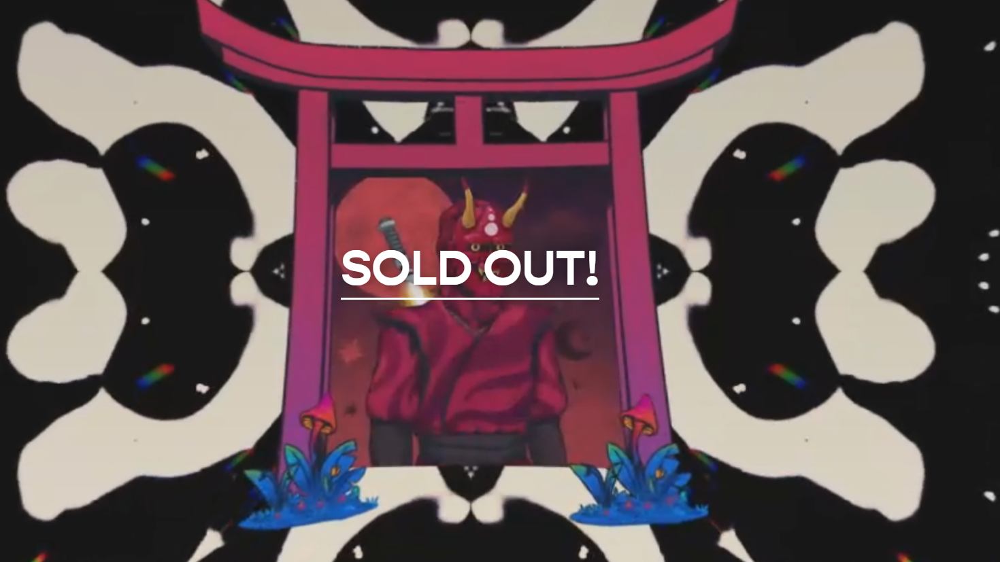

# Tie Dye Ninja - Ukraine Charity Auction

在这样的时刻，我们中的许多人会感到迷茫，作为和平战士，Tie Dye Ninja's 希望利用我们建立的平台为创作者提供回馈世界的机会。

此次拍卖的收益将全部捐赠给 NOVA 乌克兰，这是一个帮助乌克兰平民援助工作的组织。

我们非常感谢这位挺身而出并希望实现这一目标的艺术家。

艺术是治愈的。艺术就是爱。扎染忍者 - 乌克兰慈善拍卖 NFT - 常见问题（FAQ）
▶ 什么是染忍者 - 乌克兰慈善拍卖？
Tie Dye Ninja - 乌克兰慈善拍卖是一个NFT（非同质代币）系列。存储在区块链上的数字收藏品集合。
▶ Tie Dye Ninja - 乌克兰慈善拍卖代币有多少？
Ninja - Ninja - Ninja 28 个 Ninja 慈善拍卖 N N 当前 3 业主的钱包中至少有一个 Tie Dye。

