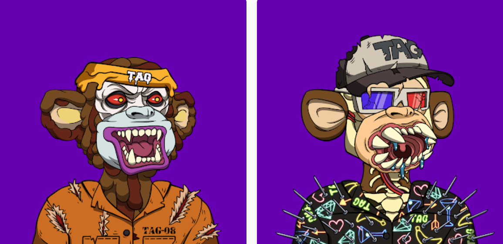

# Teen Ape Gang Mutants (TAGM)

Teen Ape Gang Mutants (TAGM) 是由 1,100 个独特的突变角色组成的私人收藏，灵感来自我们原创且已售罄的收藏。每个 Ape 的所有权证明作为 ERC-721 不可替代令牌 (NFT) 存储在以太坊网络上。Teen Ape Gang Mutants (TAGM) NFT - 常见问题（FAQ）
▶ 什么是孙猿帮变种人（TAGM）？
Teen Ape Mutants (TAGM) 是一个 NFT（非同质代币集合）。存储在区块链上的数字收藏品集合。
▶ 存在多少个 Teen Ape Gang Mutants (TAGM) 代币？
个M有一个M男112个，12个帮派，59个NFT的青少年（TAGM），至少有一个青少年（TAGM）。
▶ 什么是最昂贵的 Teen Ape Gang Mutants (TAGM) 销售？
出卖最昂贵的 Teen Ape Gang Mutants (TAGM) NFT 是 Teen Ape Gang Mutant #491。它于 2022-06-07（3 个月前）以 36.3 美元的价格售出。
▶ 不同种类的猿人（TAGM）
过去 30 个用户出售 6 个 Teen Gang Mutants (TAGpeM) NFT。
▶ 什么是流行的 Teen Ape Gang Mutants (TAGM) 替代品？
拥有 Teen Ape Gang Mutants (TAGM) NFT 的用户还拥有 EL NUMEROS、DegenOkayBears、WaterBe4nZuki 和 Old Legacy。

