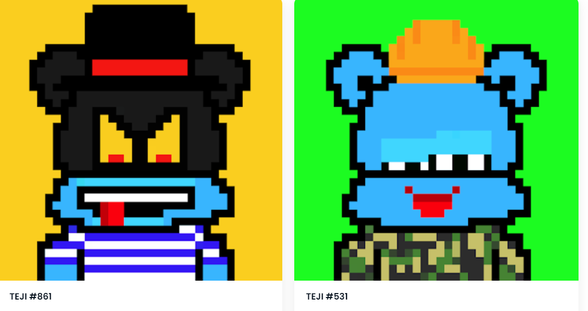

# Tejiverse

由 JET WILLIAMS 制造的 LiL RANDOM TEJI NFT。不断发展、不断学习的外星人。TEJIVERSE NFT - 常见问题（FAQ）
▶ 什么是 TEJIVERSE？
TEJIVERSE 是一个 NFT（不可替代代币）集合。存储在区块链上的数字收藏品集合。
▶ 有多少个TEJIVERSE 代币？
SEF 有 1,00 个 TEJIVER。目前，61 个 TEJI 个字的SEVERSE 中至少有一个NT。
▶ 什么是最昂贵的 TEJIVERSE 销售？
出价最贵的TEJIVERSE NFT是Teji #995。它于2022-06-06（3个月前）以27.2美元的价格售出。
▶ 精确到多少？
过去 30 条 TEVERSE NFT 售出 4 条。
▶ 什么是流行的 TEJIVERSE 替代品？
拥有TEJIVERSE NFT的用户还拥有TRANSMISSIONS909 PHASE II、EL NUMEROS、DegenOkayBears和WaterBe4nZuki。

