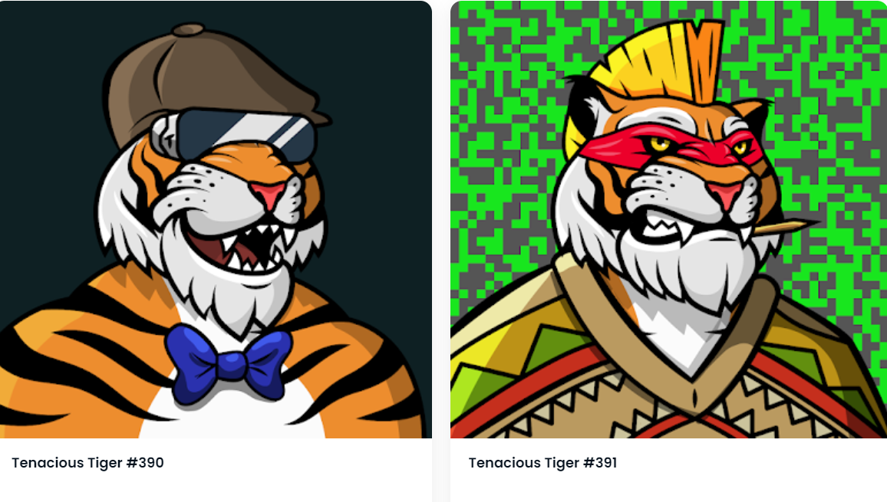

# Tenacious Tigers

这一年是 2025 年，顽强的老虎队已经接管了 Meta-Jungle。这 10,000 只随机生成的独特手绘老虎已经演变成具有自己独特的风格和个性。顽强的老虎NFT - 常见问题（FAQ）
▶ 什么是顽强的老虎？
Tenacious Tigers 是一个 NFT（非同质代币）集合。存储在区块链上的数字收藏品集合。
▶ 有多少个顽强的老虎代币？
10个8位Tenacious Tigers NFT。目前3个8位Tenacious Tigers NFT。目前车主的钱包中至少有一个NTF。
▶最近卖了多少猛虎？
过去30个共售出0个Tigers NFT。

