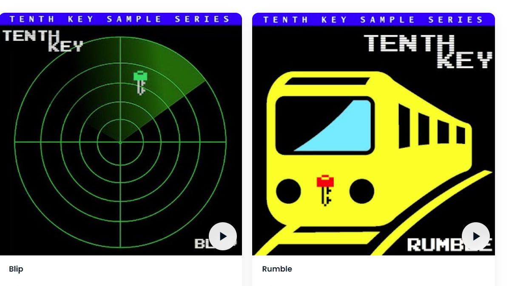

# Tenth Key Sample Series

带有免版税样本许可证的节拍和音乐创作的集合。这些 NFT 的所有者可以在自己的音乐作品中使用与他们拥有的 NFT 相关的声音和词干。第十个关键样本系列 NFT - 常见问题（FAQ）
▶ 什么是第十个重点系列样本？
第十个关键样本系列是一个 NFT（不可替代的令牌）集合。存储在区块链上的数字收藏品集合。
▶ 第十批关键样本系列代币有多少？
F有3个第1个关键样本NFT。目前2个第1个系列中至少有一个NT系列。
▶ 第十一点典型系列最简单的意义？
过去 30 个第 11 个关键词系列 0 个样本 NFT。

