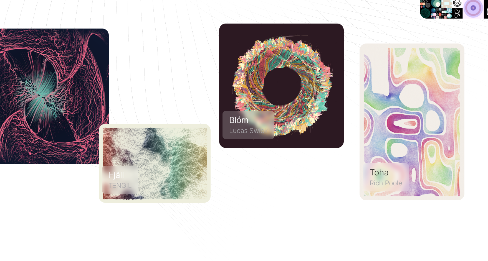

# Terroir by Kelly Milligan

石灰石、石英和粘土的碎片。古老的生长和打结的谷物。火花冒烟。我们的星星在高处。气候、土壤和地形。在此处了解有关此系列的更多信息Kelly Milligan NFT 的风土 - 常见问题（FAQ）
▶ Kelly Milligan 的风土是什么？
Kelly Milligan 的 Terroir 是 NFT（代币）系列。不可在区块链上的数字收藏品存储集合。
▶ Kelly Milligan 代币存在多少风土？
Kelly Milligan NFT由Kelly Milligan 27个土有1位。目前，业主的风里至少有一份NTF的风土。
▶ Kelly Milligan 拍卖的最贵的风土是什么？
Kelly Milligan NFT 销售的最昂贵的风土是 Terroir #151。它于 2022-06-09（3 个月前）以 360.3 美元的价格售出。
▶ Kelly Milligan 最近刚刚接触了多少风土？
在过去30个共出，NFTKelly Milligan售出3个Terroir。
▶ Kelly Milligan 的流行风土替代品有哪些？
拥有 Kelly Milligan NFTs 的 Terroir 的用户还拥有 Jos Vromans 的 Astratta、TENGIL 的 Fjall、GEN.ART Airdrop Collection 和 toimin 的 Folded Sequence。

