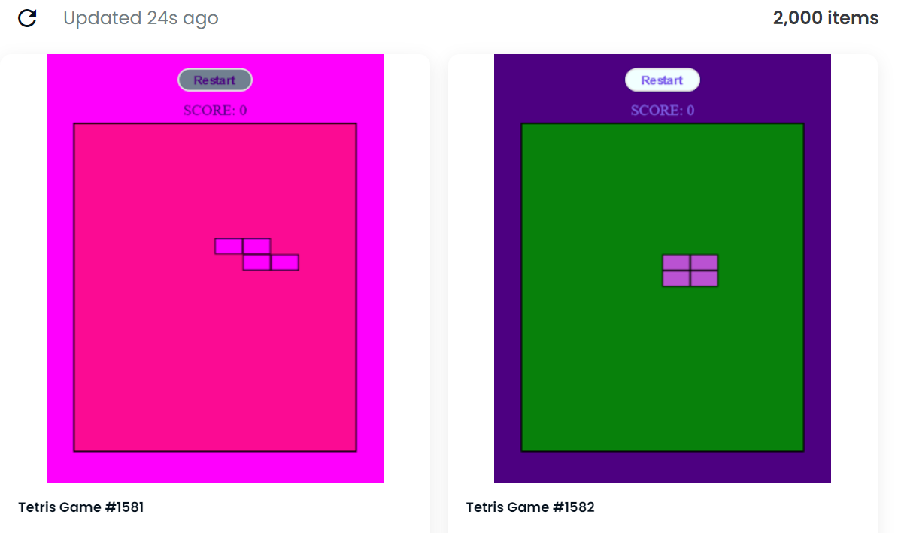

# Tetris Game NFT

怀念童年吗？NFT 可以直接在 Opensea 上玩。生活在以太坊区块链上的 2000 年俄罗斯方块游戏 NFT
的集合。非常简单的俄罗斯方块游戏 NFT 的规则：您只能以特定方式移动棋子。如果您的棋子到达屏幕顶部，您的游戏就结束了。俄罗斯方块游戏 NFT NFT - 问题常见（FAQ）
▶ 什么是俄罗斯方块游戏 NFT？
俄罗斯方块游戏 NFT 是一个 NFT（不可替代令牌）集合。存储在区块链上的数字收藏品集合。
▶ 俄罗斯方块游戏 NFT 有多少？
FFT有一个俄罗斯方块游戏2N个NFT。目前，941个游戏位的纽带中至少有一个俄罗斯方块游戏
▶ 高精度游戏有什么意义？
过去 30 个售出 NFT 游戏 0 个俄罗斯方块 NFT。
▶ 有哪些流行的俄罗斯方块游戏 NFT 替代品？
拥有俄罗斯方块游戏NFT NFT的用户还拥有Busty Anime Girls、AIKaijuz、Rescue Dogz和CryptoMonster Lab Official。

