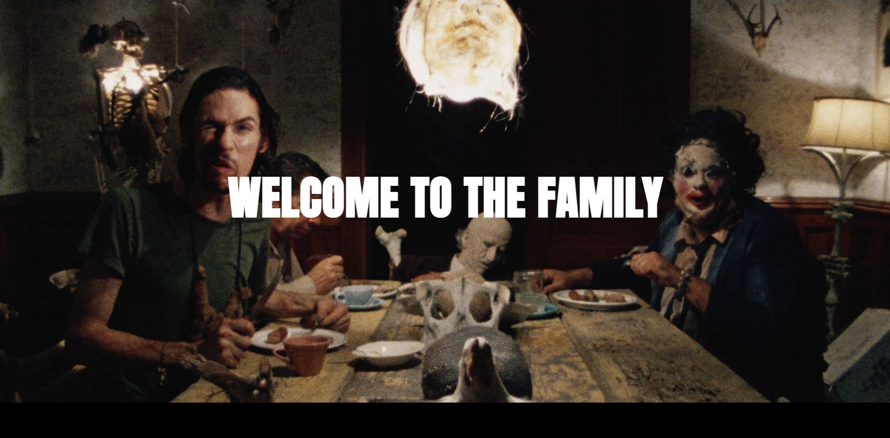

# Leatherfaces

Leatherfaces 是以太坊区块链上第一个完全授权的 PFP（资料图片）项目。我们以 905 种独特的生成 NFT 的形式将标志性的恐怖系列《德州电锯杀人狂》带入 NFT 世界，这些 NFT 由超过 250 种特征和大量的爱构成。化身只是一个开始。他们将打开通往各种会员专属福利的大门，例如奖励掉落、独家商品以及黑暗美妙的世界和社区。1973 年 8 月 18 日。一个田园诗般的星期六下午开车穿过德克萨斯州的山区，成为一个奇怪的食人家庭和戴着面具、挥舞着电锯的怪物 Leatherface 的猎物，这对五个青少年来说是一场噩梦。

在得克萨斯州夏季艰苦的三伏天，一群衣衫褴褛的电影制作人、学生、朋友、家人和追随者——以 60,000.00 美元的微薄预算工作——着手制作一部独立的恐怖电影。他们用 16 毫米镜头拍摄了《德州电锯杀人狂》（The Texas Chain Saw Massacre，1974 年），这部影片在其不起眼的开端近 50 年来被视为现代美国电影的经典之作。

