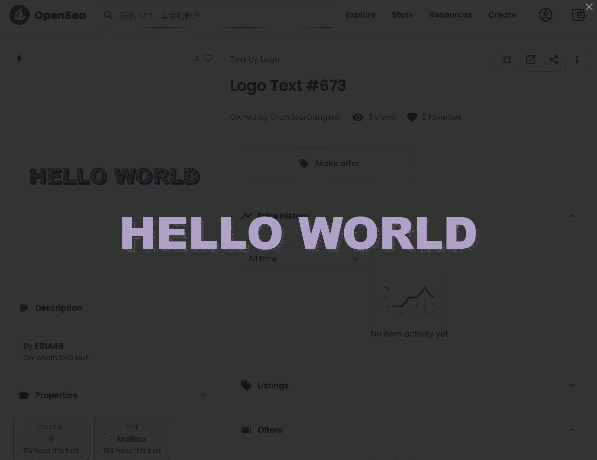

# Text by Logo

链上 SVG 文本。与 Deglomerate 徽标集成。Logo NFT 的文本 - 常见问题（FAQ）
▶ 什么是名字？
Text by Logo 是 NFT（替代代币）集合。在区块链上存储一个不可收藏的收藏品。
▶ 存在多少个 Text by Logo 令牌？
Logo NFT共有2个，350个文本当前535位的钱包中至少有一个文字，来自NTF。
▶最近简单了多少？Text by Logo
过去 30 个人售出 0 个文字 by Logo NFT。由徽标创建的链上生成svg艺术。打造出色的徽标背景。我们没有路线图。

