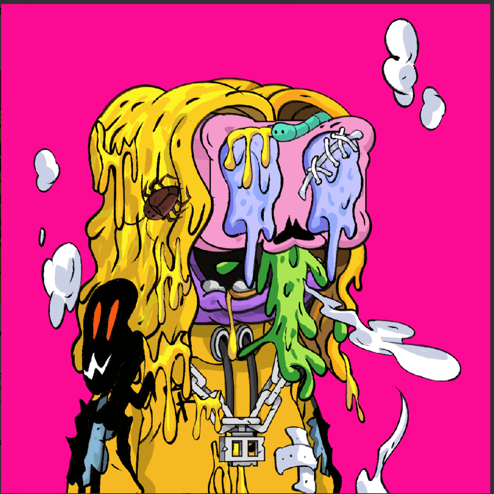

# THAI GHOSTs FARMING (TGF)

THAI GHOSTs FARMING 是 NFTs 实用项目的集合。

这些项目完成了 5,000 个 NFT 项目用于铸币。

- 供应 5,000 件物品。
- 为赠品、奖励和空投保留 100 件物品。
- 预售 1,000 件商品，每铸币 0.002 ETH，最多 10 个/钱包。
- 首次公开发售 0.003 ETH 每铸币 每个钱包最多 10 铸币。鬼故事
  曾几何时在泰国这个富有鬼故事的土地上。但此时已经没有鬼了，因为元界NFT中的一位实力萨满用无垢令牌封印了他们。所有的鬼魂都在等待可以用“薄荷按钮”解放它们的人，让它们在 Metaverse NFT 上栩栩如生。
