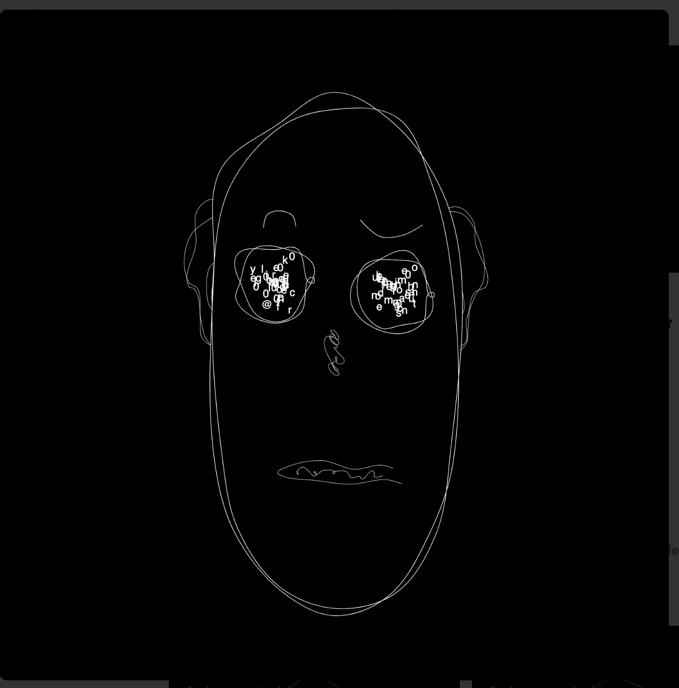

# the abstract dudes

抽象的帅哥是帅哥的派生词。它使用原始的花花公子合同 DNA 来创造一种互动的衍生艺术。这是一个概念证明，展示了原始花花公子 DNA 可以做什么。

这些作品被赠送给了花花公子的主人。关于
我们是一个在 web3 空间中构建交互艺术和设计的平台。我们相信未来是与艺术互动并从中获得不同的体验。我们的艺术是交互式的、可编程的和可扩展的。

我们为持有者提供定制 NFT 的丰富经验。在构建交互式 NFT 的同时，我们还与来自世界各地的创作者合作，使他们的艺术具有交互性。

