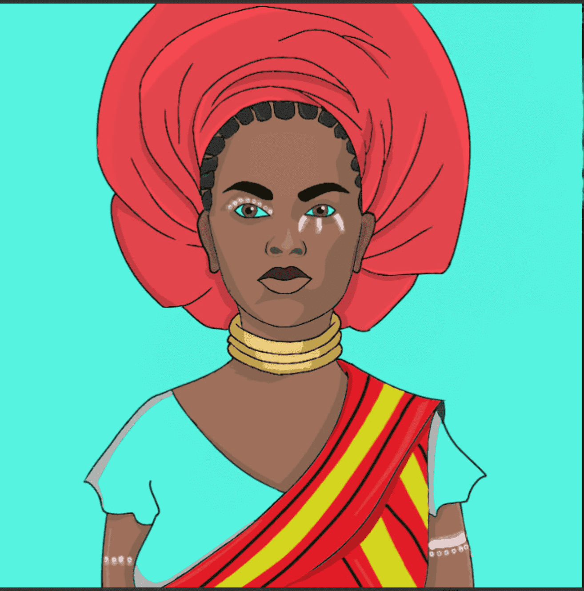

# The Afrikans NFT

我们的团队专注于快速行动。我们应该在发布后的前 2 个月完成大部分路线图，并且只打算从那里加快步伐，因为我们不断建立强大的社区支持。我们是新一代的人，将通过开发独特的娱乐工具为我们的社区提供长期价值。

薄荷日期是什么时候？Afrikans NFT 是 1111 件独特艺术品的独家收藏，每件都代表了非洲大陆丰富的文化和种族多样性。由非洲人为非洲人创建，我们正在彻底改变非洲大陆强大的 web3 生态系统，这个项目只是向前迈出的第一步。

