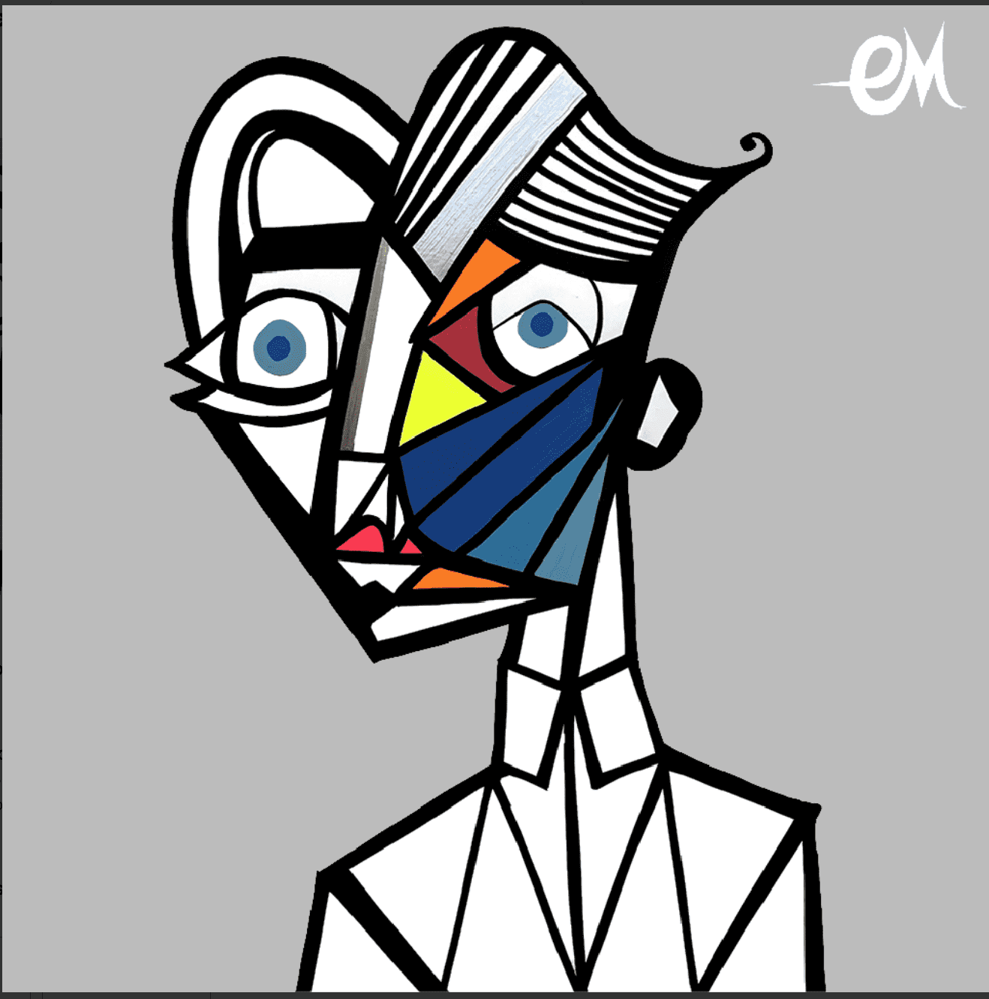

# The Aristocrats Society

贵族收藏
法国艺术家 Clément Mougel 通过他的奇异宇宙展示了他的第一个 NFT 系列，ARISTOCRATS。探索 250 件独一无二的手工和数字化作品，其中的线条仍然清晰可见，每张脸都富有表现力和独特性。每个 NFT 都与艺术家 (40x40) 的编号和签名版画相关联。它们是克莱门特的第一部作品。

每个持有者都将包含在 DAO 中，并将从新的高级收藏 ARISOCRATS 中获得空投。他们还将受邀参加世界各地画廊的展览。

