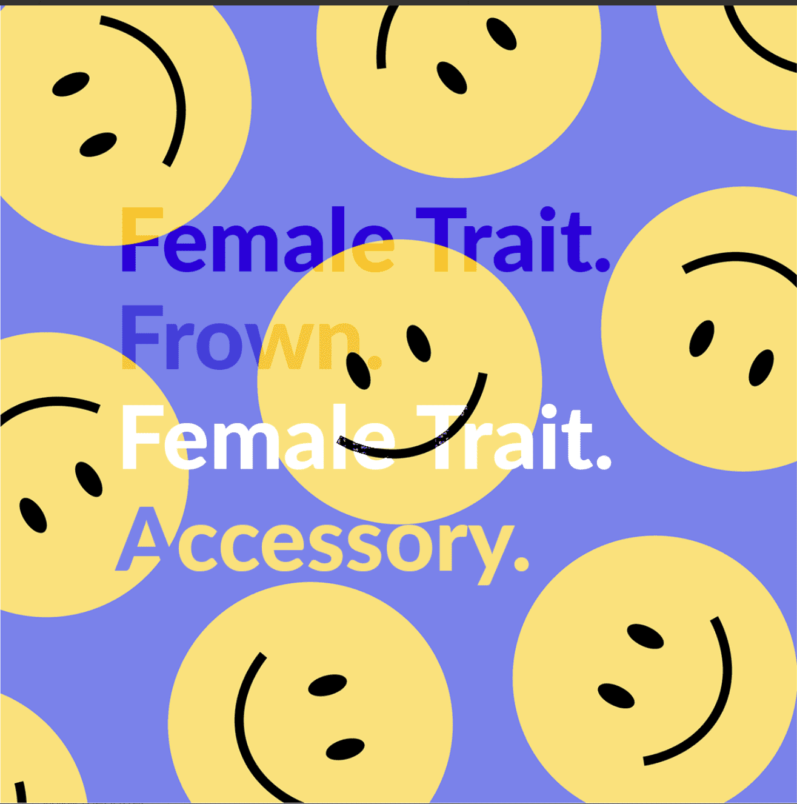

# The Avatar Project Official

Avatar Project 是由两位世界上最令人难以置信的广告大师手工制作的精美头像集合。每件作品都结合了最好的生成特征，为那些探索更广泛的元宇宙的人创造独特的在线身份。 Avatar Project 独特的压缩算法让收藏家和社区成员可以展示自己的本色，而无需视觉艺术带来的繁琐系统性能。Avatar Project 官方 NFT - 常见问题（FAQ）
▶ 什么是阿凡达项目？
阿凡达项目官方是一个NFT（非同质代币）集合。存储在区块链上的数字收藏品集合。
▶ 《阿凡达计划》官方代币有多少？
N个头像 187个头像项目 官方现在，106位的头像 官方中至少有一个 NTF。
▶ 《凡达计划》最接近了多少？
过去 30 官方共售出 0 个 Avatar Project。

