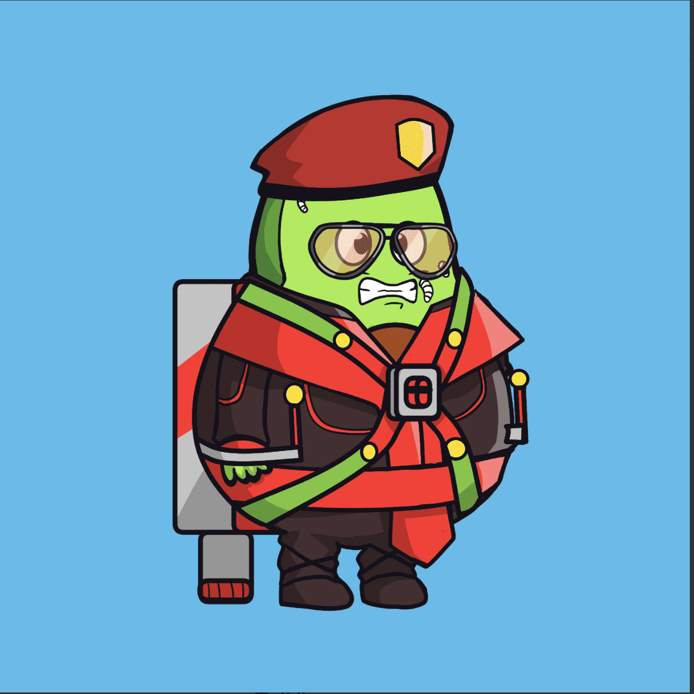

# The Avocadoodz Official

Avocadoodz 是一个以社区为中心的集合，包含 444 个可爱而独特的随机生成的 doodz。

Avocadoodz 持有者的长期愿景是建立 NFT 领域最大和最强大的社区之一，同时也为所有 doodz 持有者提供最大价值。我们还希望利用我们社区的力量为有需要的更广泛的社区做好事。Avocadoodz 官方 NFT - 问题常见（FAQ）
▶ 什么是 The Avocadoodz 官方？
Avocadoodz Official 是一个 NFT（非同质代币）集合。存储在区块链上的数字收藏品集合。
▶ 有多少个 The Avocadoodz 官方代币？
有一个官方的名字，444NFT。现在有一个官方的名字444NFT。现在有一个NT的官方名字中至少有一个。
▶ 官方最近发布了多少？
过去 30 官方共售出 0 个 NFT。

