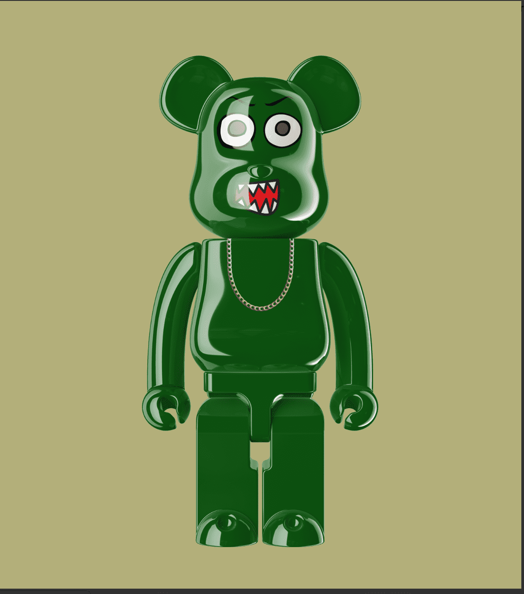

# The Bear CLTV

熊 CLTV。是 7,777 个独特的 TBC NFT 以编程方式策划和精心制作的集合，其中包含数百种变化、个性特征和配件——所有这些都存在于以太坊区块链上。但我们的 TBC NFT 还有另一个方面：您的 Bear 充当您的 CLTV 会员通行证，并授予会员专属福利，例如 VIP 访问 TBC 炒作品牌、铸币者独家铸币到实物 1 of 1 实物艺术、会员专享空投、社区赠品等等。Bear CLTV NFT - 常见问题（FAQ）
▶ 什么是熊 CLTV？
Bear CLTV 是一个 NFT（不可替代代币）集合。存储在两条链上的数字收藏品集合。
▶ 有多少 The Bear CLTV 代币？
54位熊CLTVNFT。目前有54位熊CLTVNFT。目前车主的钱包中至少有一个NTF。
▶最近什么CLTV了？
过去30个卖出0个熊CLTV NFT。

