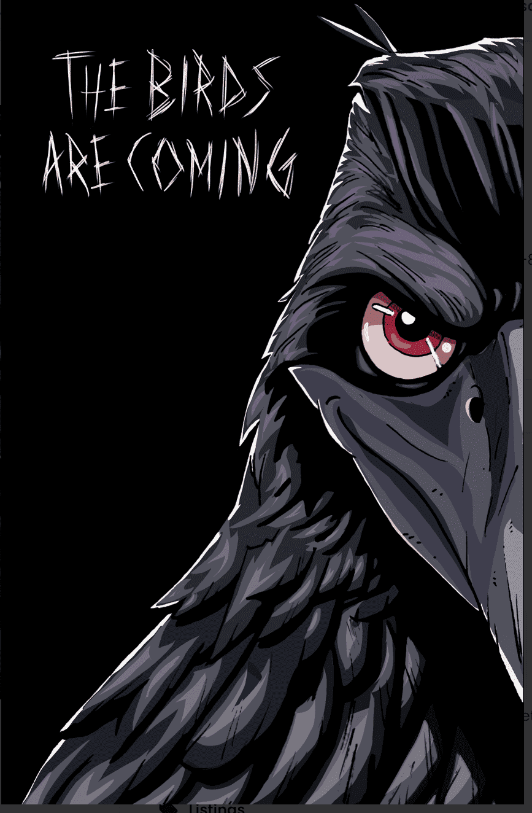

# The BirdHouse: Early Birds

The BirdHouse Early Birds 独家发售。拥有这个 NFT 可以让您内部人员访问 The BirdHouse 项目并对其未来进行投票。 BirdHouse 收藏了 6,000 只具有独特特征和个性的鸟类。在 上查看更多信息

The BirdHouse Early Birds 独家发售。拥有这个 NFT 可以让您内部人员访问 The BirdHouse 项目并对其未来进行投票。BirdHouse 收藏了 6,000 只具有独特特征和个性的鸟类。The BirdHouse: Early Birds NFT - 常见问题 (FAQ)
▶ 什么是鸟屋：早起的鸟儿？
BirdHouse：Early Birds 是一个 NFT（非同质代币）系列。在区块链上的数字收藏品集合。
▶ 有多少 The BirdHouse: Early Birds 代币？
鸟儿有63个使用：Early Birds NFT。目前62位业主的钱包中至少有一本 BirdHouse：早起的鸟儿NTF。
▶ The BirdHouse: Early Birds 最近发售多少？
过去 30 只鸟售出 0 个 The BirdHouse：Early NFT。

