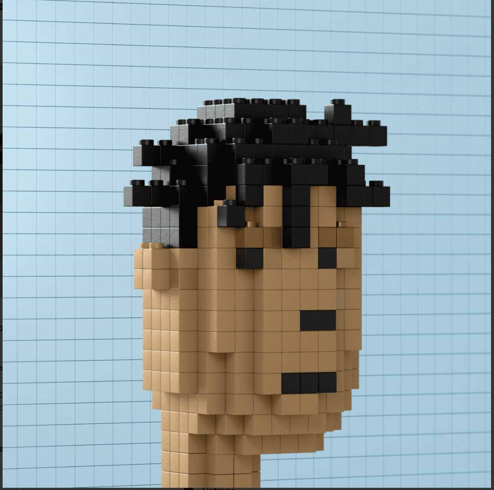

# The BlockPunks

您可以使用下面的铸币按钮抓住您的朋克并正式成为一个笨蛋。通过铸币，您将成为 NFT 历史的一部分，从一个由一个人制作的难以区分的非生成项目中获得收藏品。BlockPunks 项目是一位孤独艺术家的艰巨努力，他以积木的形式从最初的 10,000 个密码朋克中重建（一个接一个和手工）每一个朋克。

每个朋克都是用 Blender 制作的，渲染，然后在 Photoshop 中进行后期编辑处理。

这个项目不隶属于 LEGO 或 Larva Labs - 但受到对两者工作的热爱的启发。

