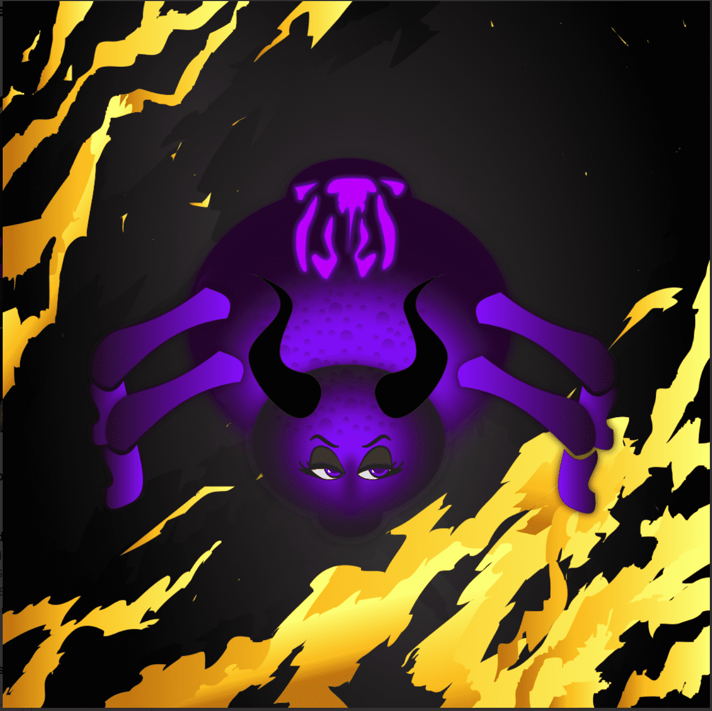

# Bored Spider Club

Bored Spider 俱乐部是 5,000 +1 个独特的 Bored Spider NFT 的集合。选择您的 Spider 并加入仅在 Polygon 网络上直播的 NO GAS FEES REVOLUTION！

1000/5000

所有高于 0.002 的出价均在欧洲中部时间下午 4 点接受无聊蜘蛛俱乐部 NFT - 常见问题（FAQ）
▶ 什么是无聊蜘蛛俱乐部？
Bored Spider Club 是一个 NFT（非同质代币）集合。存储在区块链上的数字收藏品集合。
▶ 蜘蛛代币有多少无聊？
Club NT 3,5000个NFT的俱乐部有一个无聊的蜘蛛。
▶ 蜘蛛俱乐部有多少无聊？
过去30个Bor共售出0个Spider Club NFT。

