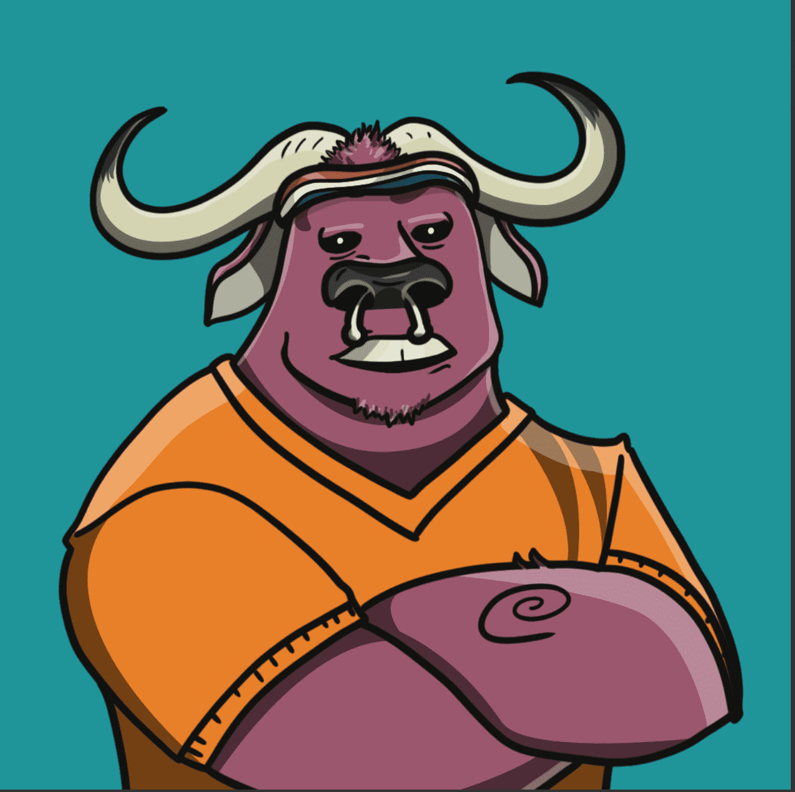

# The Bullrunners

Bull Runners 是以太坊网络的保镖。他们受雇于黑手党老大，控制街道，保护市场，监视来来往往的人。你不要惹公牛！

Bull Runners 只是这个区块链世界的一部分，他们非常喜欢以太坊网络，并确保每天的流量都顺畅运行。在过去的十年里，一股黑暗的黑暗力量潜伏在这片土地上，更多的锁链被激活，更多的邪恶涌入链上。收集你的 Bull Runners 并为战斗做好准备！

我们正在寻求建立一个基于 DAO 的社区，NFT 持有者是否可以决定项目如何随着时间的推移向前发展。这是一项非常艰巨的任务，但是使用 Discord 上的排名系统，我们将能够评估长期持有者的价值，通过其持股的质量和数量来提高或降低他们的排名，然后给予足够的投票权。

