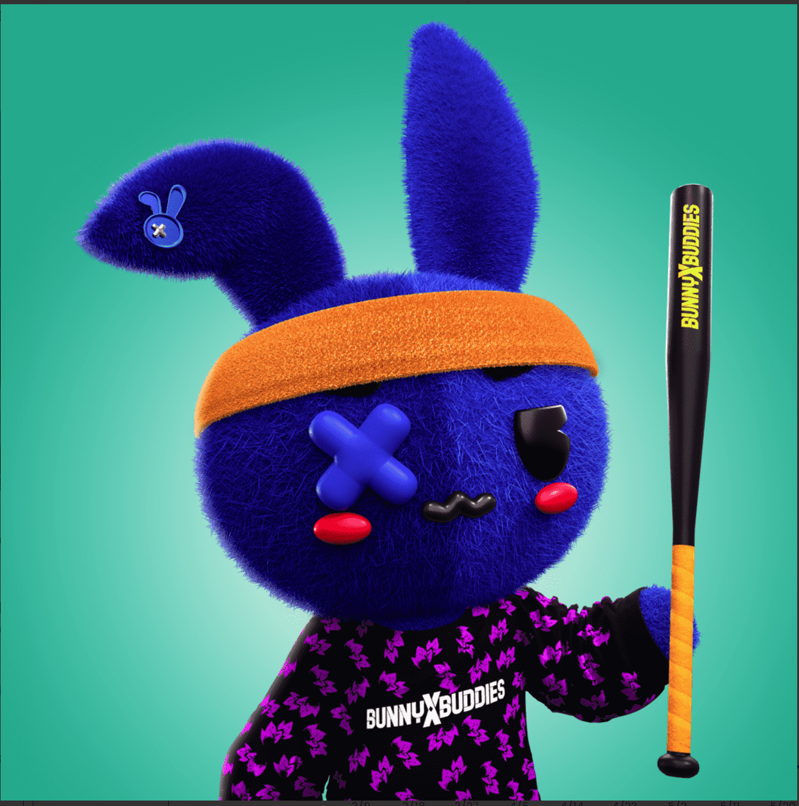

# The Bunny Buddies NFT

好友
Bunny Buddies 是 8888 只手绘兔子的集合，它们在以太坊区块链上过着最美好的生活。由 Ryan Robinson 设计，这些具有疯狂美学和强烈个性的 NFT 正在接管元界。加入项目
Bunny Buddies 是一组独特的收藏艺术品，由艺术家 Yobritish 的 Ryan Robinson aka Rhabbitz 设计。通过这个系列，这位与环球音乐、哥伦比亚唱片公司或大西洋唱片公司等主要唱片公司合作的艺术家探索了二元性，并在黑暗与光明之间寻找适当的平衡。 “这种艺术代表了我的品牌。从表面上看，你会看到可爱，但当你深入了解说唱音乐并进一步了解背景时，我可能会添加更黑暗的元素，例如说唱音乐”，罗宾逊说。您可能已经看过他的作品，现在是您第一次拥有它。

