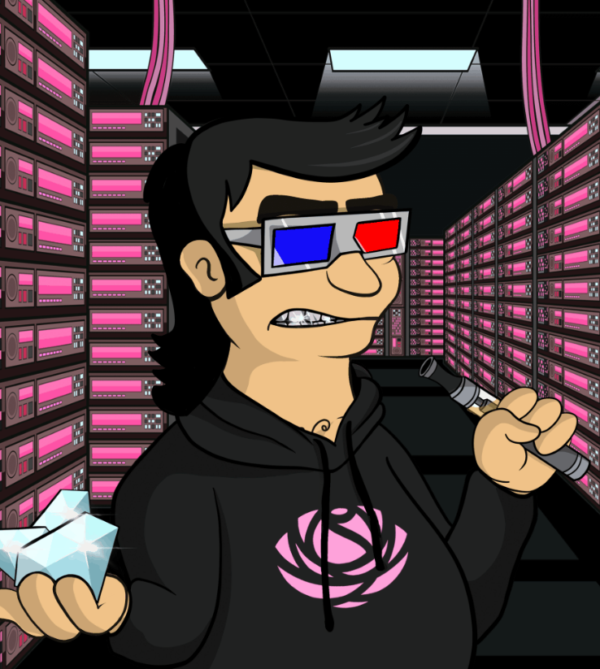

# The Crypto Cartel V2

CryptoCartel 是一个由 3,500 名国际知名加密货币富豪卡特尔成员组成的网络，他们退休并在以太坊区块链上焕发了新的活力。 为热爱、投资和持有加密货币和 NFT 的人而设的会员俱乐部。 新财富一代的成员协会，他们的大部分财富都来自加密货币和 NFT。 Crypto 已经让他们退休，现在他们正在世界各地和 Metaverse 中度假。 您的 CryptoCartel 会员可让您访问 The Plaza、The MetaVilla 和 Accumulates $AMMO 实用代币。 一个品牌和一个项目弥合了元界和 IRL 之间的差距。

