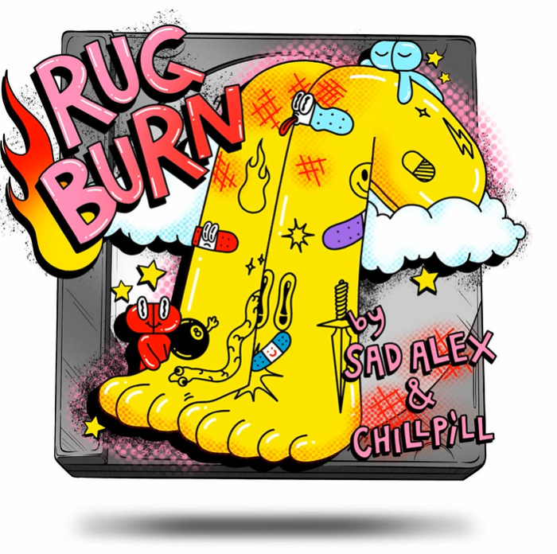

# The Decentralized Living Album On The Blockchain

这张去中心化专辑是生活在以太坊区块链上的不断变化的音乐 NFT。 每月刷新元数据以获得新音乐和独家访问商品掉落、节目等！ 由 ChillRx（@iamchillpill）创建。

The Blockchain On The Decentralized Living Album 的总销售额为 1.91 万美元。 一张区块链 NFT 上的去中心化生活专辑的平均价格为 159.4 美元。 区块链上共有 3,616 位去中心化生活相册拥有者，总共拥有 3,702 个代币。

区块链代币上的去中心化生活相册有多少？
区块链 NFT 上总共有 3,702 张去中心化生活专辑。目前，3,616 位所有者的钱包中至少有一张 The Decentralized Living Album On The Blockchain NTF。
▶ The Decentralized Living Album On The Blockchain 销售中最贵的是哪张？
区块链 NFT 上售出的最昂贵的 The Decentralized Living Album 是 The Decentralized Album #3005。它于 2022-07-02（大约 2 个月前）以 548.9 美元的价格售出。
▶ 区块链上的去中心化生活专辑最近卖出了多少张？
过去 30 天内，在区块链 NFT 上售出了 12 张 The Decentralized Living Album。
▶ 区块链上的去中心化生活相册需要多少钱？
过去 30 天，The Blockchain NFT 上最便宜的 The Decentralized Living Album 销售额低于 67 美元，最高销售额超过 473 美元。过去 30 天内，区块链 NFT 上的去中心化生活专辑的中位价格为 104 美元。
▶ 什么是流行的 The Decentralized Living Album On The Blockchain 替代品？
许多拥有 The Decentralized Living Album On The Blockchain NFT 的用户还拥有 CyberBananas、MetaRim、“I'm Spottie”和 CHILL RX。

