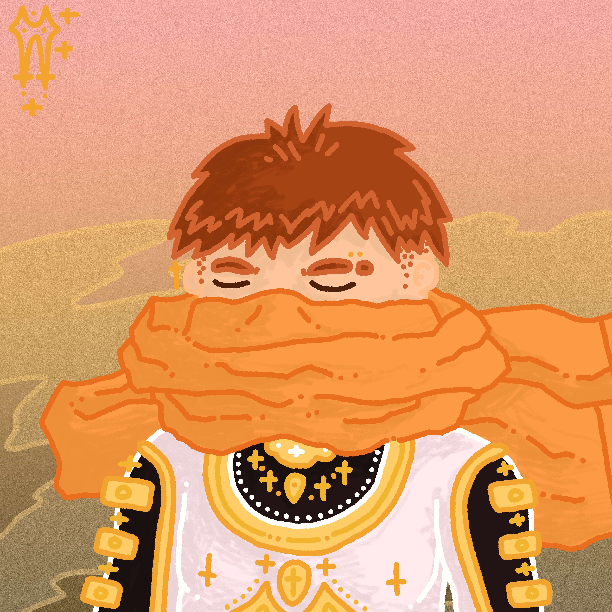

# the elysians

极乐世界是由艺术家 ely taylor 设计和绘制的极乐世界中人物的 1/1 肖像合集。 每个 elysian 在 elysia 的故事中都扮演着典型的角色，并帮助成长和建立一个不断扩大的创意世界。

有一个人在村外散步，反思他的人民的道路。他一直是个隐士，总是被自己的思想占据，无法适当地参与他的社区。今天，他村长处死了一个付不起每月什一税的人，他似乎是唯一一个为此感到不安的人。

在这次散步中，该男子瞥见了一个似乎由纯缟玛瑙制成的生物正躺在田野中。那人吓坏了，不知道这个生物是从哪里来的。当他转身奔跑时，这个存在升起，带着一千个太阳的光芒灿烂地微笑。男人跪倒在地，这生物的可怕美感吞噬了他的心智。

“不要害怕，”天使拉斐尔说。 “你以优雅的方式对待你的同胞，你和你的人民将在即将到来的神圣之火中得救。人的内心都有恶魔，你有责任将这些恶魔的知识传播给你的同胞。现在去吧，教他们平静地过自己的生活，彼此完全舒适，没有内墙将你与你的同胞隔开。”

天使站起身来，在纯蚀的一刹那，从男人的视野中消失了。他跑，跑，跑，跑到世界最远的角落去传播天使的意志。

