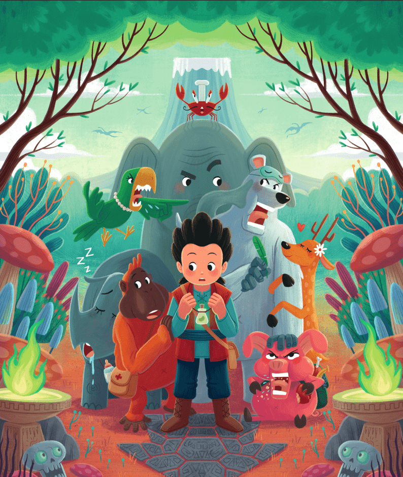

# The Fellowship of the Bean

魔豆联谊会是一群古怪的动物在勇敢的男孩瓦纳的带领下，为了从环境危机中拯救世界而取回魔豆的冒险。拯救地球的唯一方法就是种植“唯一 豆”在一个叫做地球的肚脐的地方，豆子可以长成一棵有根的大树，可以加速植物的生长，恢复地球环境的平衡。但旅途并不轻松。 他们必须穿过可怕的森林、炎热的沙漠、尖尖的洞穴、火山等等。 更别说打龙打怪鬼了。关键是，他们都没有资格做这个任务。 一切都可能出错，它会。 但运气站在他们这边。

