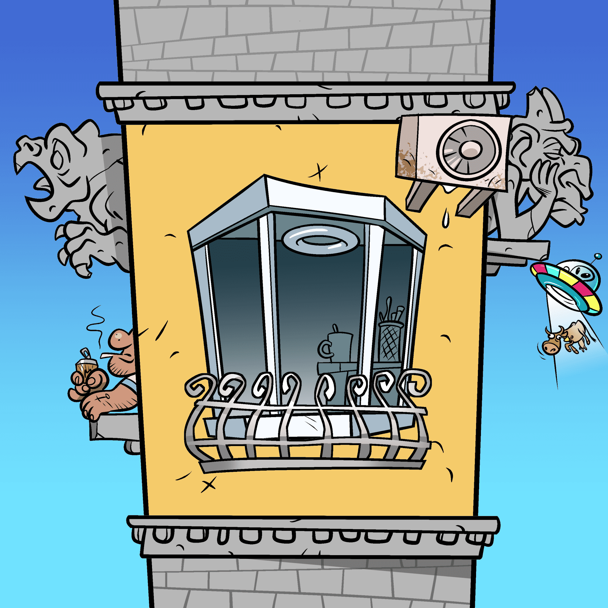

# The Floor

FLOOR NFT 系列由 7,777 个 AI 生成的收藏品 FLOOR 组成，这些 FLOOR 以艺术方式构建在以太坊区块链上。 所有 7,777 个都是由 DAHR 专门为该项目手绘的 150 多个属性以编程方式随机生成的。每个楼层都是独一无二的，并且作为楼层 Metaverse 访问，进一步解锁土地购买、资产收集以及在开发的 Metaverse 中包含的所有事件 .

谁说NFT系列应该总是包括豹皮和激光眼睛？作为NFT社区，我们难道不能做更多的事情，而不仅仅是模仿另外10k的Twitter个人资料图片吗？地板项目是我们为了让那些有需要的人的世界变得更好，同时仍然拥有所有的NFT乐趣！

地板NFT是以太坊区块链上新鲜的手绘艺术收藏品，由DAHR以其令人愉悦的卡通艺术风格精心制作。只有7777件可证明罕见的艺术品是从100多个特征/属性中产生的，以便聚集一个有史以来第一个NFT元宇宙公寓社区。

在以太坊区块链上拥有楼层可以让您访问会员制社区，这将构成未来Metaverse体验的核心。慈善捐赠，代币农业，NFT池，扫荡，赠品，空投，新收藏品以及以METAVERSE FLOOR为主题的单词 - 所有这些都在THE FLOOR NFT项目中等待着。

其他技能由楼层社区通过路线图里程碑激活来解锁。

