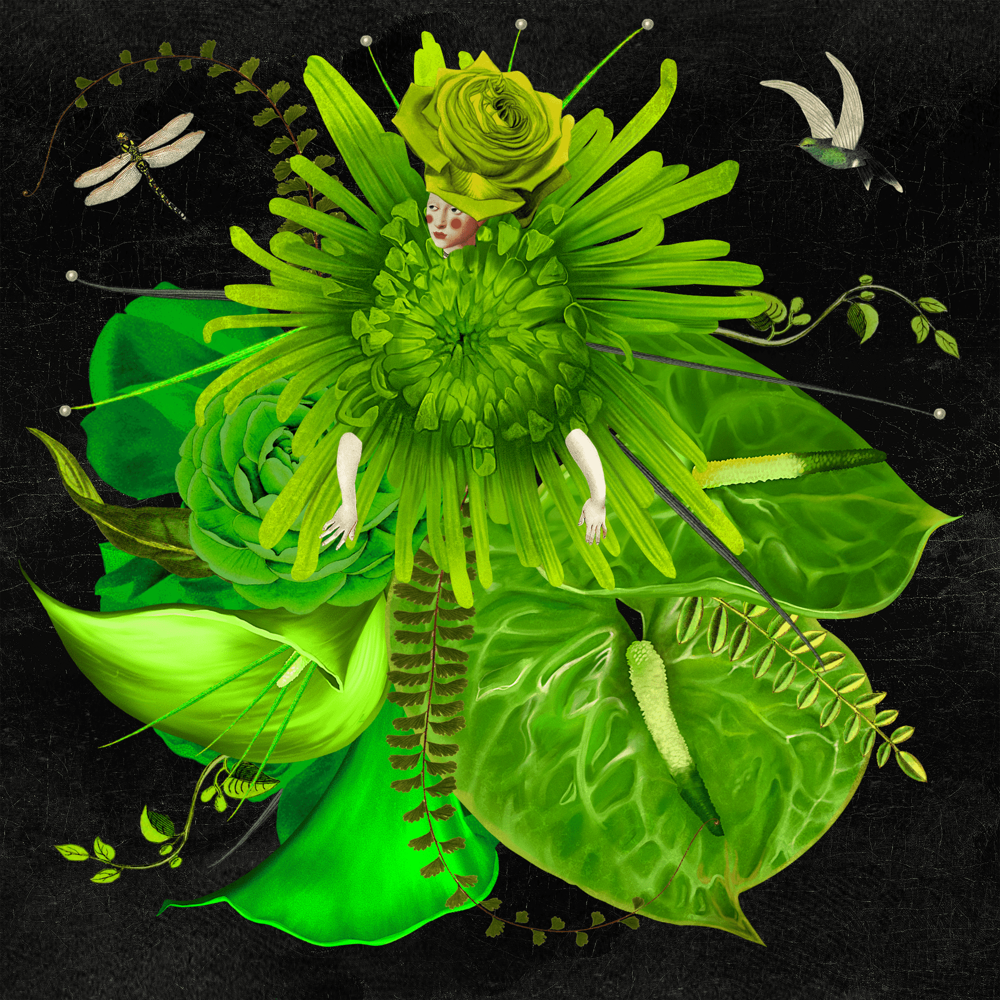

# The Flower Girls: Special Editions

10，000个独特的花姑娘的集合，由950多个手绘元素生成，并作为ERC-721令牌存储在以太坊区块链上。

花姑娘们经过四个月的精心手工制作，并由我们的定制软件以算法生成，颂扬自然之美，纯洁和多样性，提高了美术NFT收藏品的标准。

花姑娘们肩负着一项使命：她们前往金星，这是所有女性的祖先星球，一路上支持重要的慈善事业，同时也为收藏家提供独特的实用性。我们希望这个项目不仅仅是NFT，并邀请您加入我们这个令人难以置信的冒险。

