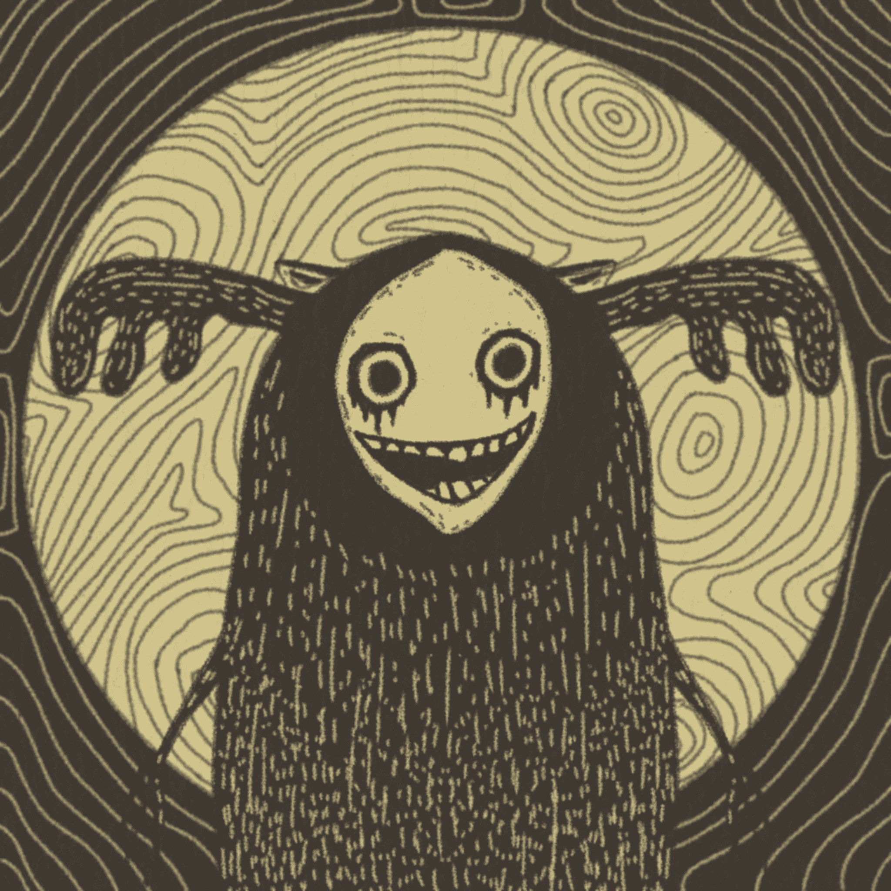

# The Forgotten Cult

为提高人们对心理健康的认识而制作的系列。 50% 的特许权使用费将用于精神卫生机构。

The Forgotten Cult 的总销售额为 0 美元。 一个 The Forgotten Cult NFT 的平均价格为 0 美元。 有 1,165 名 The Forgotten Cult 所有者，总共拥有 3,333 个代币。

什么是被遗忘的邪教？
The Forgotten Cult 是一个 NFT（非同质代币）集合。 存储在区块链上的数字艺术品集合。
▶ 有多少个被遗忘的邪教代币？
总共有 3,333 个 The Forgotten Cult NFT。 目前，1,165 位所有者的钱包中至少有一个 The Forgotten Cult NTF。
▶ The Forgotten Cult 最贵的拍卖品是什么？
最昂贵的 The Forgotten Cult NFT 是 Deity #630。 它于 2022-06-18（2 个月前）以 18.6 美元的价格售出。
▶ The Forgotten Cult 最近卖出了多少？
过去 30 天内售出了 9 个 The Forgotten Cult NFT。
▶ 什么是流行的 The Forgotten Cult 替代品？
许多拥有 The Forgotten Cult NFT 的用户还拥有 Emoticons by Logo、The Forgotten Cult Oracles、Matrix 1999 和 Omni Node Toads (ETH)。

