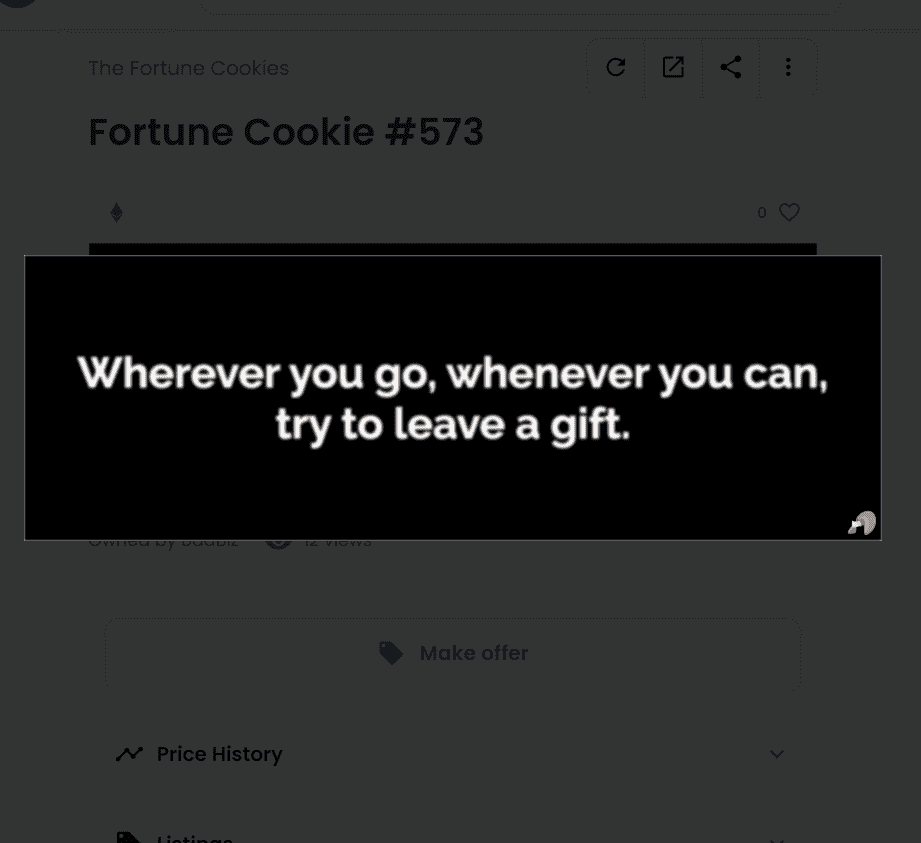

# The Fortune Cookies

你有一天会拥有一个 CryptoPunk 吗？Artchick 明天会跟随你吗？你会成功吗？Fortune Cookies 将为你提供有关 NFT 空间和生活的所有问题的答案......或者不是！Fortune Cookies 是一个 收集 10,000 件生成艺术，展示有趣、愚蠢或鼓舞人心的名言，并带有漂亮的印刷效果。其中一些是著名的名言，一些是受 NFT 和加密空间的启发，还有几千件是由一个退化的 AI 创建的 控制...有传言说创作者还写了 2 个传奇财富，可以在 10,000 个幸运饼干之一中找到。幸运饼干，你的财富永远铸造在区块链上。

您是要失去所有还是要在一次交易中恢复过来？你要翻转那个NFT吗？
888和Artchick会收藏你的艺术品吗？我们的10，000块幸运饼干将为您带来好运，并帮助您回答所有日常问题！价格？0.01 以太币每块幸运饼干。
以这个价格，我们希望您每次需要时都能破解幸运饼干！想知道你的财富是什么吗？

薄荷幸运饼干！什么是幸运饼干？
幸运饼干不仅具有独特的财富或鼓舞人心的报价，可以是好的，坏的，有趣的或愚蠢的，而且也是生成艺术的碎片，以美丽的排版效果传递每一个命运，以获得最大的享受。

有10，000个幸运饼干，每个都有自己的属性和稀有性：

字体，样式和颜色的美丽组合。
每种财富都是独一无二的，都有自己的类别。
一些财富是由degen AI创造的。
由创作者手写的传奇财富。
在以太坊区块链上创造你自己的财富，永远放在数字石头上。

