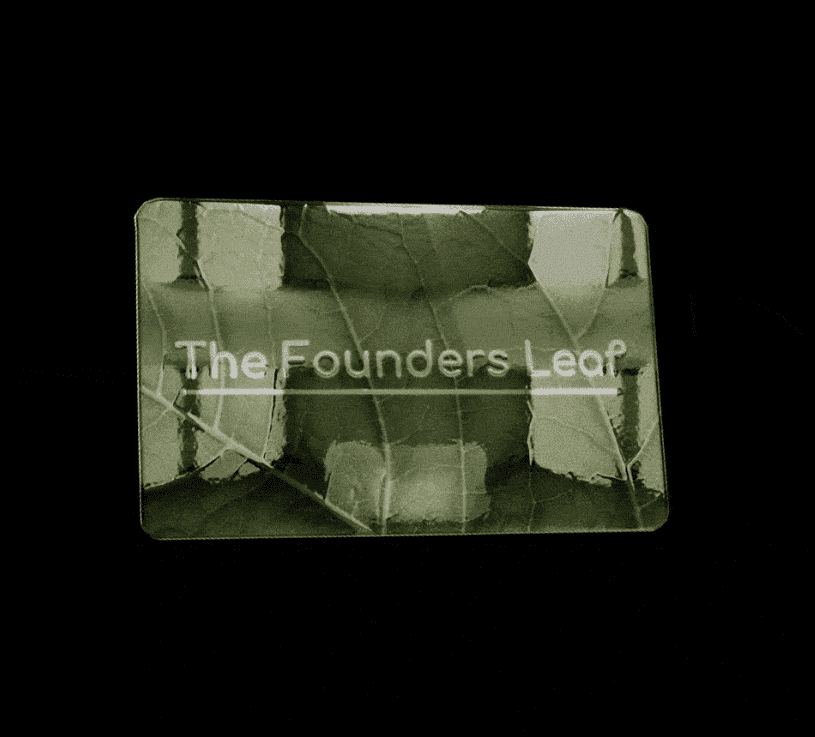

# The Founders Leaf

为收藏家、艺术家和投资者提供 500 片叶子 成为生活在以太坊区块链上的比自己更大的事物的一部分我们是一群在数字领域拥有广泛背景的设计师、开发人员和技术专家。 我们的目的是制作最著名的 NFT 收藏。

我们是设计师，开发人员和技术人员的集体，在数字领域拥有广泛的背景。我们的目的是制作最着名的NFT集合。

创始人 LEAF 开发商、投资者和艺术家之间的倡议
一个痴迷于DEFI的非凡集体，
他们都想要这个加密货币PIE的一部分，你不需要翻译
与我们合作 创作者如果你是NFT的新手，我们可以告诉你方法，
只需联系一个开发人员，然后说嘿！这个社区的目的是创造一个共同的统一体，只要看看你的眼睛，你就会看到
NFT阿尔法呼叫的海洋尽可能大。记住要HODL，否则你的头脑会感到困惑。
不要置身事外，否则你的FOMO会喷出。把狗屎硬币抛在脑后，因为它们没有效果，来加入“创始人叶集体”。

